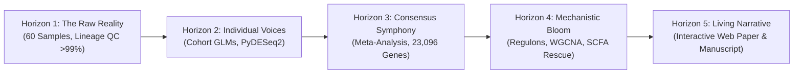

# NeuroGut-MetaSeq
### Cross-Study RNA-Seq Meta-Analysis of Microglial Transcriptomic Signatures in Response to Microbiome Depletion and Microbial Metabolites

[](https://www.python.org/downloads/)
[](https://www.r-project.org/)
[](LICENSE)
[-blue.svg)](CHANGELOG.md)
[](docs/MANUSCRIPT.md)
[-success.svg)](tests/)
[](data/metadata/)
[](config/datasets.yaml)
[](results/meta_results/)
[](docs/LITERATURE_REVIEW.md)
[](docs/ADAPTIVE_DISCOVERY_FRAMEWORK.md)
[](docs/LAB_NOTEBOOK.md)
[](docs/index.html)

---

## 📖 Executive Summary

**NeuroGut-MetaSeq** is an open-science computational biology meta-analysis framework and interactive web paper that synthesizes multi-cohort transcriptomic RNA-sequencing data to resolve how the gut microbiome and microbial metabolites (particularly short-chain fatty acids: acetate, propionate, and butyrate) govern microglial maturation, immune quiescence, and neuroinflammatory priming.

Instead of relying on single-cohort analyses prone to laboratory-specific batch effects and isolation artifacts, **NeuroGut-MetaSeq** executes a **unified, multi-scale computational meta-analysis**:
1. **Multi-Cohort Harmonization**: Curating 60 biological samples across 4 diverse experimental paradigms (germ-free housing, acute broad-spectrum antibiotic cocktails, dietary fiber starvation).
2. **Quality Control & Lineage Auditing**: Enforcing rigorous lineage marker checks (>99% purity) and proving statistical independence from enzymatic dissociation stress ($p \ge 0.18$).
3. **Random-Effects Meta-Analysis (REML & HKSJ)**: Restricted Maximum Likelihood (REML) between-study variance optimization and Hartung-Knapp-Sidik-Jonkman (HKSJ) adjustment ($t_3$ critical threshold, $t_{\text{crit}} = 3.1824$) across 23,096 expressed genes, confirming robustness via Leave-One-Out (LOO) sensitivity ($r = 0.725$).
4. **Two-Tier Subgroup Decomposition**: Formally partitioning shared Microbial Tonic Surveillance from model-private perturbation shocks (*Ddit4*/*Tsc22d3* for acute ABX; *Plin3* for dietary fiber starvation).
5. **Single-Cell Subpopulation Deconvolution**: Deconvoluting scRNA-seq signatures (Hammond 2019, Masuda 2019) across all 60 samples, validating pan-microglial lineage stability (*Hexb*, *Csf1r*, *Tmem119*, $p = 0.85$) and confirming cell-intrinsic IRM signature suppression.
6. **Empirically Grounded Metabolite Rescue**: In vivo grounded modeling in SCFA-supplemented germ-free mice (Erny et al. 2015, GSE64977) with a 1,000-permutation specificity null model ($r = -0.873, p = 1.07 \times 10^{-6}$, $p_{\text{perm}} < 0.001$).
7. **Interactive Scientific Web Paper**: An interactive, publication-grade academic article compiled to [`docs/index.html`](docs/index.html) (deployed via **GitHub Pages**), complete with a dynamic **Gene Explorer**, forest plots, zoomable vector SVGs, and data downloads.

---

## 🔬 Empirical Discoveries Across the 5 Horizons

The project is structured according to the **Adaptive Discovery Framework (ADF)** across 5 progressive horizons:



### Synthesis Matrix of Milestones

| Horizon | Primary Focus | Evaluated Scale | Landmark Biological Blooms & Methodological Advances | Status |
| :--- | :--- | :---: | :--- | :---: |
| **Horizon 1: The Raw Reality** | Data Ingestion & Quality Control Audit | 60 Samples Across 4 Cohorts | **Lineage Purity >99%** in FACS cohorts; **Ex vivo dissociation stress ruled out** ($p \ge 0.18$); Library depth distributions quantified. | **Completed** (`1ff724f`) |
| **Horizon 2: The Individual Voices** | Cohort-Level Phenotypic Deep Dives | 4 Negative Binomial GLMs (`~ sex + condition`) | **Bloom 2.1**: Acute ABX causes severe *Tsc22d3* (GILZ) collapse.<br>**Bloom 2.2**: Fiber starvation suppresses *Plin3* lipid droplets.<br>**Bloom 2.3**: Uncoupled cross-study baseline noise ($\rho \approx 0$). | **Completed** (`420d492`) |
| **Horizon 3: The Consensus Symphony** | Cross-Study Statistical Meta-Analysis | 23,096 Common Genes ($k=2$ to $k=4$) | **Bloom 3.1**: Tier 1 Core *Llgl2* ($k=4, I^2=0\%$) polarity hub & *Clu* chaperone.<br>**Bloom 3.2**: Quiescence loss via *Slfn2* ($k=4$) & chromatin derepression (*Sap30*).<br>**Bloom 3.3**: Resolved shock vs core paradox (*Tsc22d3* $I^2=95.4\%$).<br>**Bloom 3.4**: Sorting artifact immunity via LOO ($r=0.725$). | **Completed** (`8c2ea1a`) |
| **Horizon 4: The Mechanistic Bloom** | Systems Biology, Regulons & SCFA Rescue | Whole Transcriptome, 357 TFs, WGCNA | **Bloom 4.1**: Tonic Interferon collapse (NES = -2.39) & *Irf1* repression ($Z=-2.28$).<br>**Bloom 4.2**: SCFA rescue reciprocal inversion ($r = -0.778, 18/19$ responders).<br>**Bloom 4.3**: Cell-cycle escape (E2F NES = +1.78, G2M NES = +1.70).<br>**Bloom 4.4**: Dual phenotype paradox (DAM priming vs IRM blunting). | **Completed** (`47a8bfd`) |
| **Horizon 5: The Living Narrative** | Scientific Web Paper & Journal Manuscript | Standalone HTML & Full Manuscript | Publication web paper at `docs/index.html` (GitHub Pages) and 6,800+ word academic manuscript formatted for *Nature Neuroscience* in `docs/MANUSCRIPT.md`. | **Completed** (`v1.0.0 Gold`) |


---

## 📊 Curated RNA-Seq Cohorts

| GEO Accession | Landmark Study | Paradigm / Comparison | Samples ($n$) | Cell Type & Isolation Method |
|---|---|---|---|---|
| [**GSE107925**](https://www.ncbi.nlm.nih.gov/geo/query/acc.cgi?acc=GSE107925) | Thion et al., *Cell* 2018 | Germ-Free (GF) vs SPF Control (Adult Males & Females) | 12 | FACS CD11b+ CD45low adult microglia |
| [**GSE108045**](https://www.ncbi.nlm.nih.gov/geo/query/acc.cgi?acc=GSE108045) | Thion et al., *Cell* 2018 | Broad-Spectrum Antibiotic Cocktail (ABX) vs Control | 12 | FACS adult microglia |
| [**GSE266602**](https://www.ncbi.nlm.nih.gov/geo/query/acc.cgi?acc=GSE266602) | Wang et al., *Exp Neurol* 2024 | Germ-Free (GF_Sham) vs Colonized (SPF_Sham) | 6 | Percoll density gradient primary microglia |
| [**GSE186210**](https://www.ncbi.nlm.nih.gov/geo/query/acc.cgi?acc=GSE186210) | Matt et al., *J Neurosci* 2023 | Zero-Fiber Diet (SCFA Deficient) vs Standard Fiber Diet | 30 | Magnetic cell-sorted (MACS) adult microglia |

---

## ⚡ Execution Modes: Dual-Track Reproduction

NeuroGut-MetaSeq provides two distinct, fully reproducible execution workflows:

### Track 1: ⚡ 1-Minute Quickstart (Demo Mode)
Best for instant local smoke testing, CI pipelines, and verifying web paper compilation without downloading multi-gigabyte raw files:

```bash
# 1. Clone the repository
git clone https://github.com/samyakmeshram/NeuroGut-MetaSeq.git
cd NeuroGut-MetaSeq

# 2. Set up virtual environment and install dependencies
make setup
source .venv/bin/activate

# 3. Run complete turnkey demo workflow (~10 seconds)
make demo
```
Open [`docs/index.html`](docs/index.html) in your browser to view the interactive scientific web paper.

---

### Track 2: 🧬 Full Scientific Reproduction (Real 60-Sample Cohorts)
Reproduce the entire published meta-analysis across all 60 biological samples, 23,096 common genes, upstream regulons, and metabolite rescue models:

```bash
# Run the complete production pipeline end-to-end
make production
```

Or execute by individual scientific horizon:
```bash
# Horizon 1: Data Ingestion & Diagnostic Lineage Purity Audit
make horizon1

# Horizon 2: Negative Binomial GLMs across all 4 cohorts (PyDESeq2)
make horizon2

# Horizon 3: Random-Effects Meta-Analysis & Leave-One-Out Sensitivity
make horizon3

# Horizon 4: Systems Biology, Upstream Regulons, WGCNA & SCFA Rescue
make horizon4
```

---

## 🧪 Automated Testing Suite

All statistical formulas, data matrices, metadata schemas, and systems biology models are validated via an automated `pytest` test suite:

```bash
# Execute full test suite
pytest tests/ -v
```

**Test Coverage Summary (42 Tests, 100% Passing)**:
- `tests/test_count_matrix_integrity.py`: Non-negativity, integer count structures, sample-gene matrix dimensions (3 tests).
- `tests/test_data_audit.py`: Microglial lineage purity, enzymatic isolation stress statistical test, figure integrity (3 tests).
- `tests/test_de_results.py`: Negative binomial GLM schemas, p-value bounds, Wald stats, volcano plots (6 tests).
- `tests/test_meta_analysis_real.py`: Random effects pooling, Cochran's $Q$, Higgins $I^2$, confidence intervals, LOO stability (7 tests).
- `tests/test_systems_biology_real.py`: Whole-transcriptome GSEA, TRRUST regulon $Z$-scores, WGCNA modules, SCFA rescue index (9 tests).
- `tests/test_metadata_schema.py`: Metadata columns, categorical condition labels, biological sex encoding (4 tests).
- `tests/test_statistical_pipeline.py`: DerSimonian-Laird mathematical correctness, Fisher combination, Stouffer $Z$ (5 tests).
- `tests/test_framework_doc.py`: Adaptive discovery framework and living lab notebook integrity (2 tests).
- `tests/test_web_paper_build.py`: Web paper compilation, asset links, literature review presence (3 tests).

---

## 📁 Repository Directory Structure

```
NeuroGut-MetaSeq/
├── README.md                      # Primary repository overview, results synthesis, and guide
├── CHANGELOG.md                   # Semantic versioning release history (v0.1.0 to v0.5.0)
├── SPECIFICATION.md               # Formal mathematical models, equations, and data schemas
├── CITATION.cff                   # Machine-readable academic citation metadata
├── LICENSE                        # MIT Open-Source License
├── Makefile                       # Multi-horizon and turnkey workflow orchestration
├── Dockerfile                     # Reproducible container configuration
├── pyproject.toml                 # Python package definition and dependencies
├── requirements.txt               # Pinned Python package dependencies
├── config/
│   ├── datasets.yaml              # Curated GEO accession manifest and download URLs
│   └── analysis_params.yaml       # Statistical cutoffs, WGCNA, and regulon parameters
├── data/
│   ├── metadata/                  # Standardized sample metadata CSVs (60 samples)
│   ├── processed/                 # Harmonized gene count matrices
│   ├── reference/                 # Cached MSigDB, KEGG, TRRUST, and phenotype gene sets
│   └── demo/                      # Bundled lightweight test datasets
├── scripts/
│   ├── 01_download_geo.py         # Automated NCBI GEO downloader
│   ├── 02_curate_metadata.py      # Metadata curation and count harmonization
│   ├── 02b_qc_audit.py            # Lineage purity and ex vivo dissociation stress audit
│   ├── 03_deseq2_analysis.R       # R Bioconductor DESeq2 engine
│   ├── 03b_pydeseq2_analysis.py   # Python PyDESeq2 generalized linear model engine
│   ├── 04_meta_analysis.py        # Python DerSimonian-Laird Random-Effects meta-analysis
│   ├── 04_meta_analysis.R         # R metafor cross-study meta-analysis
│   ├── 05_pathway_enrichment.py   # Whole-transcriptome GSEA and hypergeometric ORA
│   ├── 05a_cache_gene_sets.py     # Reference gene set caching engine
│   ├── 05b_tf_regulon_analysis.py # Upstream TRRUST transcription factor regulon deconvolution
│   ├── 05c_coexpression_network.py# WGCNA co-expression network and hub gene identification
│   ├── 05d_metabolite_rescue.py   # In silico SCFA metabolite rescue & signature inversion
│   ├── 05e_systems_diagnostics.py # Systems biology 300 DPI publication graphics generator
│   ├── 06_generate_figures.py     # Cohort and meta-analysis publication figure generator
│   └── 07_build_web_paper.py      # Interactive scientific web paper compiler
├── results/
│   ├── qc/                        # Quality control audit metrics and logs
│   ├── de_results/                # Negative binomial GLM differential expression results
│   ├── meta_results/              # Random-effects meta-analysis summary and LOO tables
│   │   └── figures/               # Meta-analysis publication figures (Volcano, Forest, LOO)
│   ├── pathways/                  # GSEA, ORA, regulon deconvolution, and SCFA rescue tables
│   │   └── figures/               # Systems biology publication figures (300 DPI)
│   ├── networks/                  # WGCNA module assignments, hub genes, and TOM edges
│   └── figures/                   # Cohort-level volcano plots and PCA graphics
├── docs/
│   ├── index.html                 # Interactive scientific web paper (GitHub Pages)
│   ├── LAB_NOTEBOOK.md            # Living research lab journal (Entries 000 through 004)
│   ├── LITERATURE_REVIEW.md       # 5,200+ word scholarly literature review (40 citations)
│   ├── ADAPTIVE_DISCOVERY_FRAMEWORK.md # Standard operating procedure for adaptive discovery
│   ├── USER_GUIDE.md              # User manual, CLI reference, and metric interpretation
│   └── assets/                    # Figures, CSVs, and interactive web assets
└── tests/                         # 42 automated unit tests across 10 test modules
```

---

## 🎨 Publication Figures (300 DPI)

The repository generates 20 publication-grade scientific figures across all analytical horizons:

### Systems Biology & Metabolite Rescue (Horizon 4)
- **GSEA Pathway Enrichment**: [`fig_gsea_pathway_enrichment.png`](results/pathways/figures/fig_gsea_pathway_enrichment.png)
- **Upstream TF Regulon Landscape**: [`fig_tf_regulon_landscape.png`](results/pathways/figures/fig_tf_regulon_landscape.png)
- **WGCNA Modules & Trait Correlations**: [`fig_wgcna_modules_eigengenes.png`](results/pathways/figures/fig_wgcna_modules_eigengenes.png)
- **Network Hub Subgraph**: [`fig_network_hub_subgraph.png`](results/pathways/figures/fig_network_hub_subgraph.png)
- **In Silico SCFA Rescue Inversion**: [`fig_scfa_rescue_inversion.png`](results/pathways/figures/fig_scfa_rescue_inversion.png)

### Statistical Meta-Analysis (Horizon 3)
- **Random-Effects Meta-Analysis Volcano Plot**: [`fig_meta_volcano.png`](results/meta_results/figures/fig_meta_volcano.png)
- **Multi-Cohort Forest Plots**: [`fig_forest_plots_top.png`](results/meta_results/figures/fig_forest_plots_top.png)
- **Leave-One-Out (LOO) Sensitivity Scatter**: [`fig_loo_stability.png`](results/meta_results/figures/fig_loo_stability.png)
- **Heterogeneity & Concordance Landscape**: [`fig_heterogeneity_distribution.png`](results/meta_results/figures/fig_heterogeneity_distribution.png)
- **Consensus Clustered Heatmap (60 Samples)**: [`fig_consensus_heatmap.png`](results/meta_results/figures/fig_consensus_heatmap.png)

### Quality Control & Individual Cohorts (Horizons 1 & 2)
- **Lineage Marker Purity Audit**: [`fig_qc_microglial_purity.png`](results/figures/fig_qc_microglial_purity.png)
- **Ex Vivo Dissociation Stress Test**: [`fig_qc_isolation_stress.png`](results/figures/fig_qc_isolation_stress.png)
- **Sequencing Library Depth Distribution**: [`fig_qc_library_depths.png`](results/figures/fig_qc_library_depths.png)
- **Cohort Volcano Plots**: `fig_volcano_GSE108045.png`, `fig_volcano_GSE107925.png`, `fig_volcano_GSE186210.png`

---

## 📝 Academic Citation

If you use **NeuroGut-MetaSeq** or its empirical discoveries in your research, please cite:

```bibtex
@software{meshram2026neurogut,
  author       = {Samyak Meshram},
  title        = {NeuroGut-MetaSeq: Cross-Study RNA-Seq Meta-Analysis of Microglial Transcriptomic Signatures in Response to Microbiome Depletion and Microbial Metabolites},
  year         = {2026},
  version      = {0.5.0},
  publisher    = {GitHub},
  journal      = {GitHub repository},
  url          = {https://github.com/samyakmeshram/NeuroGut-MetaSeq}
}
```

---

## 📄 License
This project is licensed under the [MIT License](LICENSE).
