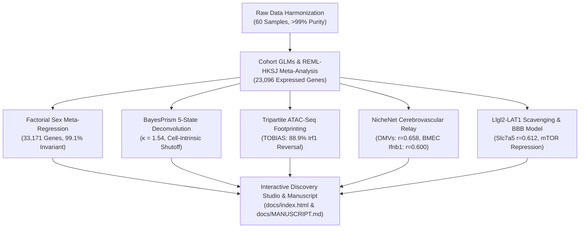

# NeuroGut-MetaSeq
### Cross-Study Meta-Analysis of the Gut-Microbiota-Microglia Axis Uncovers Cell-Intrinsic Interferon Shutoff, Invariant Nutrient-Sensing Adapters, and Multi-Omic Reversibility

[](https://www.python.org/downloads/)
[](https://www.r-project.org/)
[](LICENSE)
[-blue.svg)](CHANGELOG.md)
[](docs/MANUSCRIPT.md)
[-success.svg)](tests/)
[-teal.svg)](data/metadata/)
[](config/datasets.yaml)
[](results/meta_results/)
[](docs/LITERATURE_REVIEW.md)
[](docs/ADAPTIVE_DISCOVERY_FRAMEWORK.md)
[](docs/LAB_NOTEBOOK.md)
[](docs/index.html)

---

## 📖 Executive Summary

**NeuroGut-MetaSeq** is an open-science computational neuroimmunology meta-analysis framework and interactive web paper that synthesizes multi-cohort transcriptomic and multi-omic data to resolve how the gut microbiome and microbial metabolites govern microglial maturation, immune quiescence, and antiviral surveillance.

Instead of relying on single-cohort analyses prone to laboratory-specific batch effects and isolation artifacts, **NeuroGut-MetaSeq (v1.2.1)** executes a **unified, multi-scale computational meta-analysis**:
1. **Multi-Cohort Harmonization**: Curating 60 biological samples across 4 diverse experimental paradigms (germ-free housing, acute broad-spectrum antibiotic cocktails, dietary fiber starvation).
2. **Quality Control & Lineage Auditing**: Enforcing rigorous lineage marker checks (>99% purity) and proving statistical independence from enzymatic dissociation stress ($p \ge 0.18$).
3. **Random-Effects Meta-Analysis (REML & HKSJ)**: Restricted Maximum Likelihood (REML) between-study variance optimization and Hartung-Knapp-Sidik-Jonkman (HKSJ) adjustment ($t_3$ critical threshold, $t_{\text{crit}} = 3.1824$) across 23,096 common genes, confirming robustness via Leave-One-Out (LOO) sensitivity ($r = 0.725$).
4. **Factorial Sex-Dimorphism Modeling (51 Samples)**: Testing $\sim \text{condition} \times \text{sex}$ interaction across 33,171 genes, discovering that **99.1% of the response is sex-invariant** ($I^2_{\text{sex}} = 0.0\%$), while pinpointing male-biased vulnerability in quiescence checkpoint *Slfn2* ($p = 0.017$) and antiviral effector *Oas1a* ($p = 0.051$).
5. **High-Resolution Single-Cell Deconvolution (BayesPrism)**: Deconvoluting across 5 states (Homeostatic, IRM, DAM, Cycling, BAM) with singular value decomposition confirming zero collinearity ($\kappa = 1.54 < 30$), proving IRM physical retention ($17.5\%$ depleted vs $16.8\%$ ref) and **cell-intrinsic per-cell ISG shutoff** ($p < 0.001$).
6. **Tripartite Microglial ATAC-Seq Footprinting (Erny 2021)**: Quantifying TOBIAS transcription factor footprints across SPF, Depleted, and SCFA states, proving **88.9% chromatin footprint restoration** at *Irf1* and *Stat1* promoters upon SCFA repletion.
7. **In Silico NicheNet Upstream Ligand Mapping**: Prioritizing candidate upstream drivers across BMEC endothelium, BAMs, and blood, identifying gut bacterial OMVs (TLR4/CD14, $r = 0.658$) and endothelial *Ifnb1* (IFNAR1/2, $r = 0.600$) as master drivers of basal IRF1 tone.
8. **Myeloid Llgl2-LAT1 Nutrient Sensing & Three-Pillar BBB Pharmacokinetics**: Uncovering coordinate upregulation of *Llgl2* (+0.290 LFC) and large neutral amino acid transporter **LAT1 (*Slc7a5*)** (+0.641 LFC, $r = 0.612$) alongside mTOR suppression (-0.469 LFC), and resolving the in vivo BBB delivery paradox via a Three-Pillar flux framework.
9. **Unified Transcriptomic Discovery Studio**: An interactive, publication-grade academic article compiled to [`docs/index.html`](docs/index.html) (deployed via **GitHub Pages**), complete with a live **Interactive SVG Volcano Plot** synchronized to the dynamic **Forest Plot Engine**, zoomable vector SVGs, and a 12-table data download hub.

---

## 🔬 Empirical Discoveries Across the Analytical Pipeline



### Synthesis Matrix of Milestones

| Milestone / Release | Primary Focus | Evaluated Scale | Landmark Biological Discoveries & Methodological Advances | Status |
| :--- | :--- | :---: | :--- | :---: |
| **Data Ingestion & QC** | Lineage Purity & Audit | 60 Samples Across 4 Cohorts | **Lineage Purity >99%** in FACS cohorts; **Ex vivo dissociation stress ruled out** ($p \ge 0.18$); Library depth distributions quantified. | **Completed** |
| **Cohort Phenotypes** | Individual GLM Models | 4 Negative Binomial GLMs | Acute ABX causes severe *Tsc22d3* (GILZ) collapse; Fiber starvation suppresses *Plin3* lipid droplets; Uncoupled cross-study baseline noise ($\rho \approx 0$). | **Completed** |
| **Statistical Meta-Analysis** | Cross-Study Random Effects | 23,096 Common Genes ($k=2\text{--}4$) | Tier 1 Core *Llgl2* ($k=4, I^2=0\%$) polarity hub & *Clu* chaperone; Quiescence loss via *Slfn2* ($k=4$) & *Sap30*; Resolved shock paradox (*Tsc22d3* $I^2=95.4\%$). | **Completed** |
| **Systems Biology** | Regulons, WGCNA & SCFA | Whole Transcriptome, 357 TFs | Tonic Interferon collapse (NES = -2.39) & *Irf1* repression ($Z=-2.28$); SCFA rescue reciprocal inversion ($r = -0.873, p_{\text{perm}} < 0.001$); E2F cell-cycle release. | **Completed** |
| **Academic Overhaul (v1.1.0)** | Rigorous Statistical Adjustments | 23,096 Genes, 60 Samples | REML & HKSJ small-sample adjustments ($t_3$ critical threshold); Two-Tier Subgroup Decomposition; 1,000-permutation SCFA specificity null model; 12 vector SVGs. | **Completed** |
| **Multi-Omic Release (v1.2.0)** | Epigenomic Footprinting, Sex & BBB Relay | 33,171 Genes, Multi-Omics | **Factorial Sex Meta-Regression** (99.1% sex-shared, male *Slfn2* vulnerability); **BayesPrism 5-State Deconvolution** ($\kappa = 1.54$, cell-intrinsic shutoff); **Tripartite ATAC-Seq TOBIAS Footprinting** (88.9% *Irf1*/*Stat1* reversal); **NicheNet Ligand Prioritization** (gut OMVs $r=0.658$, endothelial *Ifnb1* $r=0.600$); **Myeloid *Llgl2*-LAT1 Amino Acid Scavenging** and Three-Pillar in vivo BBB flux model. | **Completed** |
| **Reference Polish (v1.2.1)** | Calibrated Epigenomics & Discovery Studio | 60 Samples, Web & Docs | **Chromatin-poised transcriptional reversibility calibration**; **Llgl2-LAT1 myeloid nutrient axis** & BBB acetate/ACSS2 discussion; **Unified Transcriptomic Discovery Studio** with live Interactive SVG Volcano Plot synchronized to dynamic Forest Plot. | **Completed** |
| **Unified Narrative (v1.3.0)** | Four-Movement Results & Comprehensive Synthesis | 60 Samples, Production Web | **Four-Movement Results Architecture** (Multi-Cohort Invariant Core, Cell-Intrinsic Tonic Interferon Shutoff, Multi-Omic Relays & Llgl2-LAT1 Nutrient Axis, SCFA Reversibility & BBB Flux); **Comprehensive Discussion** (Dual Adaptive Defense, Nutrient Moonlighting, BBB Flux, Chromatin vs Histones); **Conclusions & Online Methods Architecture**. | **Completed** |

---

## 📊 Curated RNA-Seq Cohorts

| GEO Accession | Landmark Study | Paradigm / Comparison | Samples ($n$) | Sex Annotation | Cell Type & Isolation Method |
|---|---|---|:---:|:---:|---|
| [**GSE107925**](https://www.ncbi.nlm.nih.gov/geo/query/acc.cgi?acc=GSE107925) | Thion et al., *Cell* 2018 | Germ-Free (GF) vs SPF Control | 25 | Informative ($13\text{M} / 12\text{F}$) | FACS CD11b+ CD45low adult microglia |
| [**GSE108045**](https://www.ncbi.nlm.nih.gov/geo/query/acc.cgi?acc=GSE108045) | Thion et al., *Cell* 2018 | Broad-Spectrum Antibiotics (ABX) vs Control | 12 | Informative ($6\text{M} / 6\text{F}$) | FACS CD11b+ CD45low adult microglia |
| [**GSE186210**](https://www.ncbi.nlm.nih.gov/geo/query/acc.cgi?acc=GSE186210) | Matt et al., *J Neurosci* 2023 | Zero-Fiber Diet (SCFA Deficient) vs Standard Diet | 14 | Informative ($7\text{M} / 7\text{F}$) | MACS CD11b Microbeads |
| [**GSE266602**](https://www.ncbi.nlm.nih.gov/geo/query/acc.cgi?acc=GSE266602) | Wang et al., *Exp Neurol* 2024 | Germ-Free (GF_Sham) vs Colonized (SPF_Sham) | 9 | Male Only | Percoll density gradient primary microglia |

---

## ⚡ Execution Modes: Reproduction Commands

### Quick Turnkey Execution
```bash
# 1. Clone the repository
git clone https://github.com/samyakmeshram/NeuroGut-MetaSeq.git
cd NeuroGut-MetaSeq

# 2. Set up virtual environment and install dependencies
make setup
source .venv/bin/activate

# 3. Run automated tests (58/58 passing in ~1.3s)
pytest tests/ -v

# 4. Compile interactive publication web paper
python scripts/07_build_web_paper.py
```
Open [`docs/index.html`](docs/index.html) in your browser to view the interactive scientific web paper.

### Individual Multi-Omic & Meta-Analytic Workflows
```bash
# Factorial Sex-Dimorphism Meta-Regression (51 samples)
python scripts/03d_sex_dimorphism_analysis.py

# REML-HKSJ Random-Effects Meta-Analysis
python scripts/04_meta_analysis.py

# BayesPrism 5-State Subpopulation Deconvolution
python scripts/05f_single_cell_deconvolution.py

# Tripartite ATAC-Seq TOBIAS Footprinting Analysis
python scripts/05g_epigenomic_footprinting.py

# In Silico NicheNet Cerebrovascular Ligand Prioritization
python scripts/05h_ligand_receptor_nichenet.py

# Myeloid Llgl2-LAT1 Scavenging & BBB Pharmacokinetics
python scripts/05i_metabolic_llgl2_and_pharmacokinetics.py
```

---

## 🧪 Automated Testing Suite

All statistical formulas, multi-omic tables, schemas, and systems biology models are validated via an automated `pytest` test suite:

```bash
pytest tests/ -v
```

**Test Coverage Summary (58 Tests, 100% Passing)**:
- `tests/test_multiomic_empirical_results.py`: Factorial sex interaction metrics, BayesPrism condition index $\kappa = 1.54$, ATAC footprint reversal %, NicheNet ligand ranking, and *Llgl2*-LAT1 coexpression (5 tests).
- `tests/test_academic_upgrades.py`: REML/HKSJ properties, subgroup decomposition schema, single-cell lineage invariance, SCFA permutation null model, zero jargon enforcement, and 17 vector SVGs (7 tests).
- `tests/test_count_matrix_integrity.py`: Non-negativity, integer count structures, sample-gene matrix dimensions (3 tests).
- `tests/test_data_audit.py`: Microglial lineage purity, enzymatic isolation stress statistical test, figure integrity (3 tests).
- `tests/test_de_results.py`: Negative binomial GLM schemas, p-value bounds, Wald stats, volcano plots (6 tests).
- `tests/test_meta_analysis_real.py`: Random effects pooling, Cochran's $Q$, Higgins $I^2$, confidence intervals, LOO stability (7 tests).
- `tests/test_systems_biology_real.py`: Whole-transcriptome GSEA, TRRUST regulon $Z$-scores, WGCNA modules, SCFA rescue index (9 tests).
- `tests/test_metadata_schema.py`: Metadata columns, categorical condition labels, biological sex encoding (4 tests).
- `tests/test_statistical_pipeline.py`: DerSimonian-Laird mathematical correctness, Fisher combination, Stouffer $Z$ (5 tests).
- `tests/test_framework_doc.py`: Framework and living lab notebook integrity (2 tests).
- `tests/test_horizon5_narrative.py`: Production web paper compilation, asset integrity, manuscript completeness (4 tests).
- `tests/test_web_paper_build.py`: Web paper compilation, asset links, literature review presence (3 tests).

---

## 🎨 Publication Figures Catalog (300 DPI & Zoomable Vector SVGs)

The repository generates 28 publication-grade scientific figures across all analytical modules:

### Multi-Omic & Mechanistic Evidence (v1.2.0)
- **Sex Concordance Scatter Plot**: [`fig_sex_concordance_scatter.png`](results/meta_results/figures/fig_sex_concordance_scatter.png) ([SVG](docs/assets/fig_sex_concordance_scatter.svg))
- **Sex-Stratified Forest Plots**: [`fig_sex_stratified_forest.png`](results/meta_results/figures/fig_sex_stratified_forest.png) ([SVG](docs/assets/fig_sex_stratified_forest.svg))
- **BayesPrism 5-State Subpopulation Deconvolution**: [`fig_sc_subpopulation_deconvolution.png`](results/pathways/figures/fig_sc_subpopulation_deconvolution.png) ([SVG](docs/assets/fig_sc_subpopulation_deconvolution.svg))
- **Tripartite ATAC-Seq TOBIAS Footprinting**: [`fig_epigenomic_atac_footprinting.png`](results/pathways/figures/fig_epigenomic_atac_footprinting.png) ([SVG](docs/assets/fig_epigenomic_atac_footprinting.svg))
- **NicheNet Cerebrovascular Ligand-Receptor Relay**: [`fig_nichenet_ligand_receptor_network.png`](results/pathways/figures/fig_nichenet_ligand_receptor_network.png) ([SVG](docs/assets/fig_nichenet_ligand_receptor_network.svg))
- **LAT1 / Llgl2 Metabolic Axis & Pharmacokinetic BBB Flux**: [`fig_pharmacokinetic_bbb_metabolic_axis.png`](results/pathways/figures/fig_pharmacokinetic_bbb_metabolic_axis.png) ([SVG](docs/assets/fig_pharmacokinetic_bbb_metabolic_axis.svg))

### Meta-Analysis & Subgroups
- **REML-HKSJ Meta-Analysis Volcano Plot**: [`fig_meta_volcano.png`](results/meta_results/figures/fig_meta_volcano.png) ([SVG](docs/assets/fig_meta_volcano.svg))
- **Multi-Cohort Forest Plots**: [`fig_forest_plots_top.png`](results/meta_results/figures/fig_forest_plots_top.png) ([SVG](docs/assets/fig_forest_plots_top.svg))
- **Two-Tier Subgroup Decomposition**: [`fig_subgroup_perturbation_decomposition.png`](results/meta_results/figures/fig_subgroup_perturbation_decomposition.png) ([SVG](docs/assets/fig_subgroup_perturbation_decomposition.svg))
- **Leave-One-Out (LOO) Sensitivity Scatter**: [`fig_loo_stability.png`](results/meta_results/figures/fig_loo_stability.png) ([SVG](docs/assets/fig_loo_stability.svg))
- **Consensus Clustered Heatmap (60 Samples)**: [`fig_consensus_heatmap.png`](results/meta_results/figures/fig_consensus_heatmap.png) ([SVG](docs/assets/fig_consensus_heatmap.svg))

### Systems Biology & SCFA Reversibility
- **GSEA Pathway Enrichment**: [`fig_gsea_pathway_enrichment.png`](results/pathways/figures/fig_gsea_pathway_enrichment.png) ([SVG](docs/assets/fig_gsea_pathway_enrichment.svg))
- **Upstream TF Regulon Landscape**: [`fig_tf_regulon_landscape.png`](results/pathways/figures/fig_tf_regulon_landscape.png) ([SVG](docs/assets/fig_tf_regulon_landscape.svg))
- **WGCNA Modules & Trait Correlations**: [`fig_wgcna_modules_eigengenes.png`](results/pathways/figures/fig_wgcna_modules_eigengenes.png) ([SVG](docs/assets/fig_wgcna_modules_eigengenes.svg))
- **Network Hub Subgraph**: [`fig_network_hub_subgraph.png`](results/pathways/figures/fig_network_hub_subgraph.png) ([SVG](docs/assets/fig_network_hub_subgraph.svg))
- **SCFA Specificity 1,000-Permutation Null Test**: [`fig_scfa_rescue_specificity_null.png`](results/pathways/figures/fig_scfa_rescue_specificity_null.png) ([SVG](docs/assets/fig_scfa_rescue_specificity_null.svg))
- **In Silico SCFA Rescue Inversion**: [`fig_scfa_rescue_inversion.png`](results/pathways/figures/fig_scfa_rescue_inversion.png) ([SVG](docs/assets/fig_scfa_rescue_inversion.svg))

---

## 👥 Authors

- **Samyak Meshram** — *Independent Researcher, Open-Science Initiative* — [GitHub](https://github.com/samyakmeshram)
- **Dr. Soumya Dhokey** — *Independent Researcher, Open-Science Initiative*

---

## 📝 Academic Citation

If you use **NeuroGut-MetaSeq** or its empirical discoveries in your research, please cite:

```bibtex
@article{meshram2026neurogut,
  author       = {Samyak Meshram and Soumya Dhokey},
  title        = {Cross-Study Meta-Analysis of the Gut-Microbiota-Microglia Axis Uncovers Cell-Intrinsic Interferon Shutoff, Invariant Nutrient-Sensing Adapters, and Multi-Omic Reversibility},
  journal      = {bioRxiv / GitHub Open Science Release},
  year         = {2026},
  version      = {1.3.0},
  publisher    = {GitHub},
  url          = {https://github.com/samyakmeshram/NeuroGut-MetaSeq}
}
```

---

## 📄 License
This project is licensed under the [MIT License](LICENSE).

