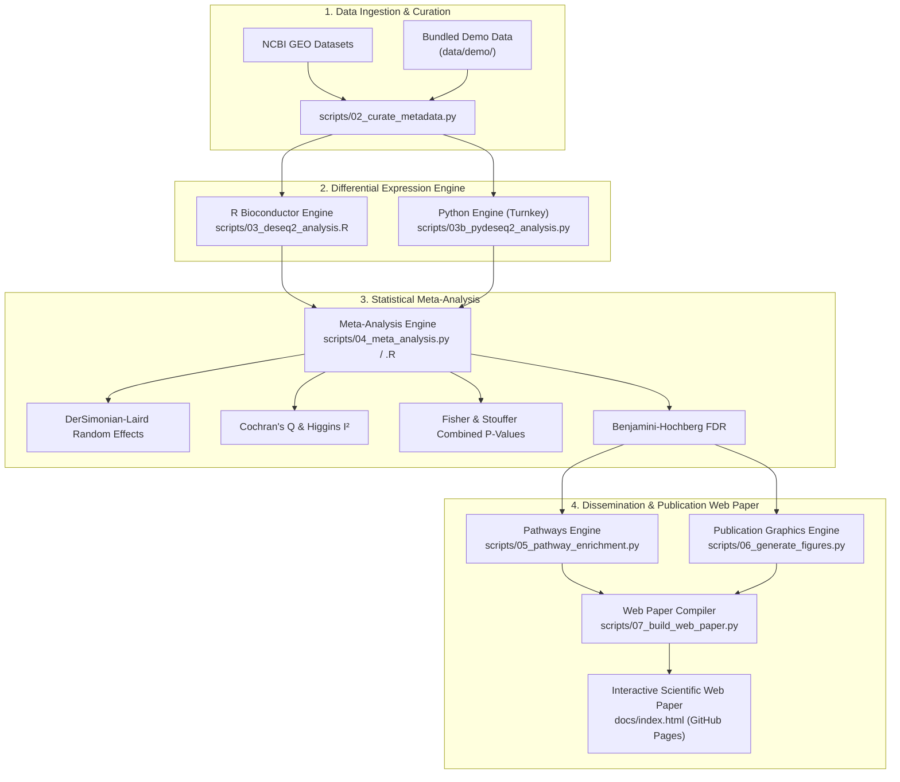

# NeuroGut-MetaSeq
### Cross-Study RNA-Seq Meta-Analysis of Microglial Transcriptomic Signatures in Response to Microbiome Depletion and Microbial Metabolites

[](https://www.python.org/downloads/)
[](https://www.r-project.org/)
[](LICENSE)
[](Dockerfile)
[](SPECIFICATION.md)
[](docs/LITERATURE_REVIEW.md)
[](docs/ADAPTIVE_DISCOVERY_FRAMEWORK.md)
[](docs/LAB_NOTEBOOK.md)
[](docs/index.html)

---

## 📖 Executive Summary & Web Paper

**NeuroGut-MetaSeq** is an open-science computational biology meta-analysis framework that synthesizes multi-cohort transcriptomic RNA-sequencing data to resolve how the gut microbiome and microbial metabolites (particularly short-chain fatty acids: butyrate, propionate, and acetate) govern microglial maturation and neuroinflammatory cascades.

Instead of relying on single-cohort analyses prone to laboratory-specific batch effects, **NeuroGut-MetaSeq** executes a **unified bi-directional meta-analysis**:
1. **Microbiome Depletion Signature**: Quantifying core transcriptomic deficits in germ-free (GF) and antibiotic-treated (ABX) adult microglia.
2. **Metabolite Rescue Signature**: Characterizing the anti-inflammatory cascades triggered by microbial metabolite supplementation (e.g., Butyrate and Dietary Fiber).
3. **Interactive Scientific Web Paper**: An interactive, publication-ready academic article is automatically compiled to [`docs/index.html`](docs/index.html) (deployable via **GitHub Pages**), featuring an interactive **Gene Search Explorer**, dynamic **Forest Plots**, and full data download buttons.

---

## 🔬 Scientific Background & Biological Questions

Microglia are the resident macrophages and immune sentinels of the central nervous system (CNS). Emerging evidence shows that microglial maturation, synaptic pruning, and surveillance phenotypes are constantly calibrated by biochemical cues originating from the distal gut microbiota.

```
+---------------------+         Circulation / Portal         +-------------------------------+
|   Gut Microbiota    | -----------------------------------> |       Brain Microglia         |
|                     |                                      |                               |
| Non-digestible      |    Short-Chain Fatty Acids (SCFAs)   |  * Checkpoint Maintenance     |
| dietary fibers      |    - Butyrate (C4)                   |    (Tmem119, Cx3cr1, P2ry12)  |
|         ↓           |    - Propionate (C3)                 |  * Restraint of NF-κB / TNF   |
| Bacterial           |    - Acetate (C2)                    |    (Nfkb1, Tnf, Il1b, Ccl2)   |
| Fermentation        |                                      |  * Epigenetic HDAC Regulation |
+---------------------+                                      +-------------------------------+
```

### Key Questions Answered:
1. **What is the universal, cross-cohort microglial signature of gut dysbiosis/depletion?**  
   We identify a conserved set of checkpoint genes (*Tmem119*, *Cx3cr1*, *P2ry12*, *Ffar2*) consistently downregulated across independent studies, paired with baseline priming of NF-κB signaling (*Nfkb1*, *Rela*, *Tnf*, *Il1b*).
2. **Does microbial metabolite restoration rescue these transcriptional lesions?**  
   Concordance and discordance analysis reveals that SCFA supplementation suppresses inflammatory cytokines and restores homeostatic surface receptor expression.
3. **Which downstream inflammatory pathways are most sensitive to microbial cues?**  
   Over-representation and gene set enrichment analyses pinpoint **NF-κB signaling**, **cytokine-cytokine receptor interaction**, **chemokine signaling**, and **phagosomal maturation** as primary effectors.

---

## 📊 Curated RNA-Seq Cohorts

| GEO Accession | Landmark Study | Comparison | Samples ($n$) | Tissue / Cell Type |
|---|---|---|---|---|
| [**GSE107925**](https://www.ncbi.nlm.nih.gov/geo/query/acc.cgi?acc=GSE107925) | Thion et al., *Cell* 2018 | Germ-Free (GF) vs SPF Control (Adult Males & Females) | 12 | FACS CD11b+ CD45low adult microglia |
| [**GSE108045**](https://www.ncbi.nlm.nih.gov/geo/query/acc.cgi?acc=GSE108045) | Thion et al., *Cell* 2018 | Antibiotic (ABX) Microbiome Depletion vs Control | 12 | FACS adult microglia |
| [**GSE266602**](https://www.ncbi.nlm.nih.gov/geo/query/acc.cgi?acc=GSE266602) | Wang et al., *Exp Neurol* 2024 | Germ-Free (GF_Sham) vs Colonized (SPF_Sham) | 6 | Adult primary microglia |
| [**GSE186210**](https://www.ncbi.nlm.nih.gov/geo/query/acc.cgi?acc=GSE186210) | Matt et al., *J Neurosci* 2023 | Zero-Fiber (SCFA-Deficient) vs Standard Fiber Diet | 46 | Adult brain microglia |

---

## 🏗️ Computational Architecture



---

## ⚡ Quickstart: 1-Command Reproduction

Clone the repository and run the complete end-to-end pipeline in one step:

```bash
# Clone the repository
git clone https://github.com/samyakmeshram/NeuroGut-MetaSeq.git
cd NeuroGut-MetaSeq

# Create virtual environment and install dependencies
make setup

# Run end-to-end pipeline and compile the scientific web paper
make all
```

Open [`docs/index.html`](docs/index.html) in your browser to explore the interactive paper and figures!

---

## 🚀 Step-by-Step Pipeline Execution

### 1. Set Up Environment
```bash
python3 -m venv .venv
source .venv/bin/activate
pip install -r requirements.txt
```

### 2. Curate Metadata & Harmonize Counts
```bash
python scripts/02_curate_metadata.py --demo
```

### 3. Run Differential Expression (PyDESeq2 or R DESeq2)
```bash
# Turnkey Python execution
python scripts/03b_pydeseq2_analysis.py --demo

# Or R Bioconductor execution (requires R and DESeq2)
Rscript scripts/03_deseq2_analysis.R
```

### 4. Run Multi-Cohort Statistical Meta-Analysis
```bash
python scripts/04_meta_analysis.py --demo
```

### 5. Biological Pathway Enrichment (KEGG, GO, Reactome)
```bash
python scripts/05_pathway_enrichment.py --demo
```

### 6. Render Publication Figures
```bash
python scripts/06_generate_figures.py --demo
```

### 7. Compile Standalone Interactive Web Paper
```bash
python scripts/07_build_web_paper.py
```

---

## 🧪 Automated Testing

Verify data integrity, schema consistency, and statistical formulas with `pytest`:

```bash
pytest tests/ -v
```

---

## 🐳 Docker Containerization

Run the pipeline anywhere without local dependencies using Docker:

```bash
# Build the Docker image
make docker-build

# Run pipeline inside container
make docker-run
```

---

## 📁 Repository Directory Structure

```
NeuroGut-MetaSeq/
├── README.md                      # Publication overview and documentation
├── SPECIFICATION.md               # Formal mathematical & technical specification
├── CITATION.cff                   # Academic citation metadata
├── LICENSE                        # MIT License
├── Makefile                       # High-level workflow orchestration
├── Dockerfile                     # Reproducible container configuration
├── pyproject.toml                 # Python package definition
├── requirements.txt               # Pinned Python dependencies
├── install_packages.R             # R package installer
├── .github/
│   └── workflows/
│       └── reproducibility_ci.yml # GitHub Actions CI & Pages deployment
├── config/
│   ├── datasets.yaml              # GEO accessions and dataset manifest
│   └── analysis_params.yaml       # Statistical thresholds & parameters
├── data/
│   ├── raw/                       # Downloaded raw GEO count files
│   ├── metadata/                  # Standardized sample metadata CSVs
│   ├── processed/                 # Harmonized count matrices
│   └── demo/                      # Bundled lightweight test datasets
├── scripts/
│   ├── 01_download_geo.py         # Automated NCBI GEO downloader
│   ├── 02_curate_metadata.py      # Metadata curation and count harmonization
│   ├── 03_deseq2_analysis.R       # R Bioconductor DESeq2 engine
│   ├── 03b_pydeseq2_analysis.py   # Python PyDESeq2 engine
│   ├── 04_meta_analysis.py        # Python random-effects & p-value meta-analysis
│   ├── 04_meta_analysis.R         # R metafor meta-analysis
│   ├── 05_pathway_enrichment.py   # KEGG and GO pathway enrichment
│   ├── 05_pathway_enrichment.R    # R clusterProfiler pathway enrichment
│   ├── 06_generate_figures.py     # Publication figures generator (PNG/SVG)
│   └── 07_build_web_paper.py      # Interactive scientific web paper compiler
├── results/
│   ├── de_results/                # Individual cohort DEG tables
│   ├── meta_results/              # Cross-study pooled effect sizes & meta-FDRs
│   ├── pathways/                  # Enriched pathway summary tables
│   └── figures/                   # Publication-ready figures (300 DPI)
├── docs/
│   ├── index.html                 # Interactive scientific web paper
│   ├── LITERATURE_REVIEW.md       # Comprehensive academic literature review (5,200+ words)
│   ├── ADAPTIVE_DISCOVERY_FRAMEWORK.md # Standard operating procedure for adaptive discovery
│   ├── LAB_NOTEBOOK.md            # Living research lab journal (chronological entries)
│   ├── USER_GUIDE.md              # User and deployment manual
│   └── assets/                    # Figures, CSVs, and interactive assets
└── tests/
    ├── test_metadata_schema.py    # Metadata validation tests
    ├── test_count_matrix_integrity.py # Count matrix integrity tests
    ├── test_statistical_pipeline.py # Unit tests for meta-analysis math
    └── test_web_paper_build.py    # Web paper validation tests
```

---

## 📝 Citation

If you use **NeuroGut-MetaSeq** in your research, please cite:

```bibtex
@software{meshram2026neurogut,
  author       = {Samyak Meshram},
  title        = {NeuroGut-MetaSeq: Cross-Study RNA-Seq Meta-Analysis of Microglial Transcriptomic Signatures in Response to Microbiome Depletion and Microbial Metabolites},
  year         = {2026},
  publisher    = {GitHub},
  journal      = {GitHub repository},
  howpublished = {\url{https://github.com/samyakmeshram/NeuroGut-MetaSeq}}
}
```

---

## 📄 License
This project is licensed under the [MIT License](LICENSE).
