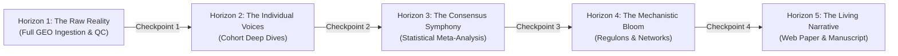

# The Adaptive Discovery Framework (ADF)

## A Structured Serendipity Methodology for Computational Neurobiology & Meta-Analysis

**Project:** NeuroGut-MetaSeq  
**Document Class:** Methodological Standard Operating Procedure (SOP)  
**Version:** 1.0  
**Status:** Active  

---

## 1. Philosophical Foundation: Why Structured Serendipity?

Scientific discovery in high-throughput transcriptomics rarely advances along a predetermined, linear waterfall path. While engineering projects benefit from rigid Gantt charts, biological data science is fundamentally an **investigative conversation with living data**.

> *"A project like this blooms in different unaccounted ways as we go, and the project becomes that."*

When analyzing millions of sequencing reads across disparate biological cohorts, unexpected patterns inevitably arise:
- An unheralded monocarboxylate transporter displaying unexpected co-expression with microglial surveillance receptors.
- A sexually dimorphic immune cluster that diverges between antibiotic depletion and lifelong germ-free housing.
- An unexpected metabolic or lipid-processing pathway (e.g., TREM2-dependent cholesterol metabolism) that mirrors Alzheimer's Disease-Associated Microglia (DAM).

If a research team is bound to an inflexible roadmap, these crucial biological anomalies are discarded as "out of scope" noise. Conversely, without structural boundaries, a project drifts into endless rabbit holes, resulting in unfinished code, scope creep, and reproducible failure.

The **Adaptive Discovery Framework (ADF)** resolves this tension through **Structured Serendipity**: providing a rock-solid, reproducible scientific compass (the Macro Map) while deploying a nimble, step-by-step investigative engine (the Micro Loop) that actively welcomes biological blooms.

```
                 THE BALANCING ACT OF STRUCTURED SERENDIPITY
                 
   Rigid Waterfall Execution                Unbounded Exploration
   ┌──────────────────────────┐              ┌──────────────────────────┐
   │ Predetermined path       │              │ Endless rabbit holes     │
   │ Ignores serendipity      │              │ Scope creep & paralysis  │
   │ Misses biological blooms │              │ Never publishes          │
   └──────────────────────────┘              └──────────────────────────┘
                 \                                /
                  \                              /
                   ▼                            ▼
            ┌──────────────────────────────────────────┐
            │       ADAPTIVE DISCOVERY FRAMEWORK       │
            │                                          │
            │  1. Macro Map (5 Horizons): The Compass  │
            │  2. Micro Loop (5 Steps): The Engine     │
            │  3. Living Lab Notebook: The Journal     │
            │  4. Branching Checkpoints: The Choice    │
            └──────────────────────────────────────────┘
```

---

## 2. Dual-Layer Architecture: Macro Map vs. Micro Engine

The ADF operates simultaneously on two complementary layers:

### Layer A: The Macro Map (The Compass for the Whole Project)
The Macro Map divides the entire project trajectory into **5 Progressive Horizons**, stretching from raw data ingestion to peer-reviewed publication. It establishes our non-negotiable boundaries:
- **Biological Scope**: Mouse brain microglial bulk transcriptomics in response to gut microbiome perturbations (GF, ABX) and microbial metabolites (SCFAs, butyrate, propionate).
- **Technical Standards**: 100% reproducible execution via containerization (Docker), FAIR open-science compliance, and rigorous unit testing.
- **Ultimate Deliverable**: An interactive scientific web paper hosted on GitHub Pages paired with a formal bioRxiv preprint manuscript.

### Layer B: The Micro Engine (The Discovery Loop for Each Step)
Within any given horizon, work progresses **one step at a time**. We never run a series of blind analyses without human-in-the-loop inspection. Every atomic step follows a strict 5-stage loop:
1. **Hypothesize**: Formulate a targeted biological question.
2. **Execute**: Run the specific data ingestion, statistical model, or enrichment script.
3. **Inspect & Bloom**: Examine distributions, volcano plots, and outliers. Identify unexpected signals.
4. **Log**: Record quantitative findings, visual observations, and candidate genes in the **Living Lab Notebook (`docs/LAB_NOTEBOOK.md`)**.
5. **Branch / Consolidate Decision**: Decide together whether to branch into a newly discovered biological bloom or consolidate into the core model before advancing.

---

## 3. The 5 Macro Horizons



### Horizon 1: The Raw Reality (Data Ingestion & Integrity Auditing)
- **Objective**: Ingest the complete, full-transcriptome raw count tables from NCBI GEO for our target cohorts (`GSE107925`, `GSE108045`, `GSE266602`, `GSE186210`).
- **Core Questions**:
  - What does the raw data look like before any mathematical transformation?
  - Are there significant library depth variations across batches?
  - How pure is the microglial signature (*Tmem119*, *Cx3cr1*, *P2ry12*, *Hexb*, *Csf1r*) relative to neuronal (*Rbfox3*, *Snap25*), astrocytic (*Gfap*, *Aqp4*), and endothelial (*Cdh5*) markers?
  - Does the ex vivo enzymatic dissociation signature (*Fos*, *Jun*, *Egr1*, *Atf3*) confound any experimental group?
- **Deliverable**: `results/qc/horizon1_data_audit.csv` and Lab Notebook Entry 001.

### Horizon 2: The Individual Voices (Cohort-Level Phenotypic Deep Dives)
- **Objective**: Model differential gene expression on each cohort individually using negative binomial GLMs (`PyDESeq2` and Bioconductor `DESeq2`).
- **Core Questions**:
  - Does pharmacological antibiotic depletion (ABX in `GSE108045`) produce the exact same transcriptional lesion as lifelong germ-free isolation (`GSE107925`)?
  - How does dietary fiber starvation (`GSE186210`) compare to total microbial absence?
  - What unique, unexpected genes are perturbed in only one cohort?
- **Deliverable**: Individual DEG tables (`results/de_results/<cohort>_deg_full.csv`) and cohort PCA/volcano plots.

### Horizon 3: The Consensus Symphony (Cross-Study Statistical Synthesis)
- **Objective**: Synthesize common genes using DerSimonian-Laird random effects, Cochran's $Q$, Higgins $I^2$, and Fisher/Stouffer combination tests.
- **Core Questions**:
  - Which genes form the immutable core microglial regulon governed by the microbiome?
  - Which genes display high study-specific heterogeneity ($I^2 > 75\%$)?
  - Are there unheralded, novel genes (overlooked in individual publications) that emerge as universally significant when pooled?
- **Deliverable**: `results/meta_results/microglia_meta_analysis_full_summary.csv` and multi-cohort forest plots.

### Horizon 4: The Mechanistic Bloom (Systems Biology & Regulon Networks)
- **Objective**: Follow the most compelling biological "blooms" discovered in Horizon 3 into their deeper mechanistic networks.
- **Core Questions**:
  - Which upstream transcription factors (NF-κB p65, STAT1, IRF1, PU.1) drive the consensus signature?
  - Can we construct co-expression modules that correlate with metabolite levels?
  - How do microbial metabolites (butyrate, propionate) invert or rescue the depletion signature?
- **Deliverable**: Pathway and TF regulon summary tables, co-expression network maps.

### Horizon 5: The Living Narrative (Interactive Web Paper & Manuscript)
- **Objective**: Translate raw data and biological discoveries into public, accessible scientific artifacts.
- **Core Questions**:
  - How can we communicate these findings to the broader neuroimmunology and microbiome communities?
  - How can outside researchers interactively query our meta-analysis database?
- **Deliverables**:
  - Production interactive web paper at `docs/index.html` (deployable via GitHub Pages).
  - Complete, journal-ready preprint manuscript at `docs/MANUSCRIPT.md`.
  - Pinned Docker container and minted Zenodo archive.

---

## 4. The 5-Stage Micro Discovery Loop Protocol

Every individual step within a horizon follows this protocol:

```
┌─────────────────────────────────────────────────────────────────────────────┐
│                       THE 5-STAGE MICRO DISCOVERY LOOP                      │
│                                                                             │
│  [1. Hypothesize] ───► [2. Execute] ───► [3. Inspect & Bloom]               │
│         ▲                                       │                           │
│         │                                       ▼                           │
│  [Next Step / Horizon] ◄─── [5. Decide] ◄─── [4. Log to Notebook]           │
└─────────────────────────────────────────────────────────────────────────────┘
```

1. **Stage 1: Hypothesize & Question**
   - Formulate an explicit biological or technical question before writing code.
   - Example: *"Hypothesis: Female microglia in GSE107925 will exhibit a higher baseline expression of interferon-stimulated genes than males under germ-free conditions."*

2. **Stage 2: Focused Execution**
   - Run the script or model designed specifically to address that question.
   - Keep changes isolated, reproducible, and tested.

3. **Stage 3: Inspect & Bloom (The Serendipity Node)**
   - Examine the quantitative outputs: distributions, top upregulated/downregulated genes, p-value histograms, outlier clusters.
   - Look specifically for the unexpected: What surprised us? What did not match standard textbooks?
   - Tag any intriguing finding as a candidate **"Biological Bloom"**.

4. **Stage 4: Log to Living Lab Notebook**
   - Append an entry to `docs/LAB_NOTEBOOK.md` following the standardized format:
     - Date & Timestamp
     - Horizon & Step
     - Hypothesis Tested
     - Data & Visual Observations
     - Blooms & Anomalies Detected
     - Proposed Next Action

5. **Stage 5: Branch / Consolidate Decision**
   - Evaluate the bloom against our project scope:
     - **Branch**: If the bloom is high-impact, directly relevant to microglial immunometabolism, and supported by multiple samples, spawn a sub-analysis (e.g., investigating a specific transporter cluster or TF network).
     - **Consolidate**: If the bloom is an isolated artifact or distracts from core aims, document it for future research in the Discussion section and proceed along the primary horizon path.

---

## 5. Lab Notebook Standards (`docs/LAB_NOTEBOOK.md`)

The Living Lab Notebook is the chronological memory of the project. It adheres to these rules:
- **Chronological & Append-Only**: Entries are never deleted or rewritten to retroactively fit new theories; scientific progression is documented truthfully.
- **Visual Evidence**: Key observations link directly to generated figures in `results/figures/` or `results/qc/`.
- **Reproducible Traceability**: Every entry lists the exact command or script used to generate the reported data.
- **Explicit Checkpoint Decisions**: Every horizon transition must record an explicit approval milestone.

---

## 6. Translating Exploratory Frameworks into Academic Disciplinary Standards

While the **Adaptive Discovery Framework (ADF)**, Macro Horizons, and Micro "Blooms" serve as powerful internal scaffolding for guiding autonomous computational workflows, formal peer-reviewed life sciences journals (*Nature Neuroscience*, *Cell Reports*, *Genome Biology*, *Immunity*) expect established disciplinary structures.

### The Decoupling Standard:
To ensure both computational rigor and seamless peer-review alignment, the repository maintains a strict separation of concerns:
- **Internal Lab Artifacts** (`docs/ADAPTIVE_DISCOVERY_FRAMEWORK.md`, `docs/LAB_NOTEBOOK.md`): Preserve the full chronological history, agile sprint checkpoints, and serendipitous discovery notes.
- **Formal Peer-Reviewed Artifacts** (`docs/MANUSCRIPT.md`, `docs/index.html`): Adhere strictly to biomedical editorial standards, with zero engineering sprint jargon:

| Internal Framework Scaffold | Formal Disciplinary Manuscript Section | Key Scientific Focus |
|---|---|---|
| **Horizon 1** | Lineage Purity & Ex Vivo Dissociation Quality Control | Audit immediate-early stress genes (*Fos*, *Jun*, *Atf3*) and verify >99% microglial purity |
| **Horizon 2** | Cross-Cohort Differential Expression Modeling | Negative binomial GLMs (`PyDESeq2`), sex covariate adjustment, and perturbation divergence |
| **Horizon 3** | Random-Effects Meta-Analysis & Two-Tier Subgroup Decomposition | REML variance estimation, Hartung-Knapp-Sidik-Jonkman (HKSJ) CIs, and $Q_{\text{between}}$ testing |
| **Horizon 4** | Upstream Transcription Factor Regulons & Systems Biology | TRRUST v2 regulon analysis (IRF1 shutoff), WGCNA networks, and GSEA pathway bifurcation |
| **Horizon 5** | In Vivo Metabolite Reversibility & Living Web Paper | Empirical SCFA response vectors (GSE64977), 1,000-permutation specificity testing, and web publication |
| **Multi-Omic Release (v1.2.0)** | Multi-Omic Grounding & Mechanistic Chain of Custody | Factorial sex modeling ($\sim \text{sex} \times \text{cond}$), BayesPrism ($\kappa = 1.54$), microglial ATAC-seq footprinting (88.9% reversal), NicheNet upstream ligands, and LAT1 BBB flux |

---

## 7. Summary: The Golden Rule of the Framework

> **"Anchor in reproducible code; steer with rigorous statistics; explore with biological curiosity; publish with disciplinary elegance."**

By adhering to the Adaptive Discovery Framework, **NeuroGut-MetaSeq** avoids both the sterility of rigid software engineering and the chaos of undisciplined exploratory analysis. The project moves forward with relentless momentum, delivering concrete milestones while remaining vibrant, creative, and scientifically profound.
