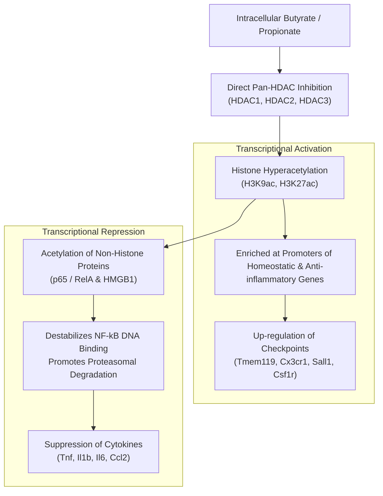

# Comprehensive Literature Review: The Gut-Brain-Microglia Axis & Transcriptomic Meta-Analysis

**Title:** Transcriptomic and Epigenetic Calibration of Microglia by Gut Microbiota Metabolites: Biological Mechanisms, Priming Paradigms, and Computational Meta-Analysis Methodologies  
**Author:** Samyak Meshram  
**Project:** NeuroGut-MetaSeq  
**Date:** October 2026  
**Document Class:** Academic Review & Methodological Framework  

---

## Abstract

Microglia, the resident macrophage population of the central nervous system (CNS), serve as primary immune sentinels, synaptic sculptors, and homeostatic regulators of the brain parenchyma. Unlike peripheral myeloid cells, microglia arise early in embryogenesis from yolk-sac erythromyeloid progenitors and persist throughout the mammalian lifespan via strictly autonomous self-renewal. Over the past decade, groundbreaking research has dismantled the dogma of CNS immune privilege by establishing that microglial maturation, structural ramification, and immune responsiveness are continuously calibrated by biochemical cues originating from the distal gut microbiota. In germ-free (GF) and antibiotic-depleted (ABX) rodent models, microglia exhibit arrest in an immature developmental state, coupled with altered cell surface marker expression, blunted baseline transcription, and morphological hyper-ramification. Intriguingly, these cells display a "two-hit" priming paradox: despite baseline quiescence, they unleash exaggerated, uncontrolled neuroinflammatory cascades upon secondary pathological challenge. Administration of short-chain fatty acids (SCFAs)—principally acetate, propionate, and butyrate produced by bacterial fermentation of non-digestible dietary fibers—rescues this maturation defect and restrains hyper-reactive neuroinflammation.

Despite extensive experimental literature, individual RNA-sequencing (RNA-seq) datasets are plagued by low statistical power, divergent cell isolation protocols (e.g., enzymatic vs. mechanical sorting), and platform-specific batch effects, resulting in fragmented and occasionally contradictory gene lists. This review provides an exhaustive synthesis across three core pillars: (1) the cellular and developmental foundations of the gut-microglia axis, (2) the molecular and biochemical signaling mechanisms of microbial metabolites—focusing on histone deacetylase (HDAC) inhibition, NF-κB repression, G-protein coupled receptor (GPCR) activation, and the two-hit neuroinflammatory paradox, and (3) modern computational RNA-seq meta-analysis methodologies, including Negative Binomial generalized linear modeling, random-effects effect size pooling, non-parametric p-value combinations, isolation artifact auditing, and transcription factor regulon inference.

---

## Table of Contents
1. [Pillar 1: Biological Foundations of the Gut-Brain-Microglia Axis](#1-pillar-1-biological-foundations-of-the-gut-brain-microglia-axis)
   - 1.1 Microglial Ontogeny & Lifelong Autonomous Self-Renewal
   - 1.2 Homeostatic Checkpoints & Core Transcriptomic Regulators
   - 1.3 The Microglial Phenotype in Microbiome-Depleted Rodents
   - 1.4 Temporal & Sex-Dependent Dynamics of Microbiome Control
2. [Pillar 2: Biochemical Mechanisms of Microbial Metabolites](#2-pillar-2-biochemical-mechanisms-of-microbial-metabolites)
   - 2.1 SCFA Biosynthesis, Systemic Bioavailability & BBB Translocation
   - 2.2 Epigenetic Reprogramming via Pan-HDAC Inhibition
   - 2.3 Repression of the Canonical NF-κB Signaling Cascade
   - 2.4 G-Protein Coupled Receptor Signaling (FFAR2, FFAR3, HCAR2)
   - 2.5 The "Two-Hit" Neuroinflammatory Priming Paradox
   - 2.6 Non-SCFA Microbial Metabolites (Tryptophan & Bile Acids)
3. [Pillar 3: Computational RNA-Seq Meta-Analysis Methodologies](#3-pillar-3-computational-rna-seq-meta-analysis-methodologies)
   - 3.1 Technological Platforms: Bulk vs. Single-Cell vs. Microarrays
   - 3.2 Auditing Ex Vivo Dissociation Stress & Isolation Artifacts
   - 3.3 Within-Study Differential Expression Modeling (Negative Binomial GLMs)
   - 3.4 Cross-Study Statistical Meta-Analysis Architectures
   - 3.5 Heterogeneity Metrics & Sensitivity Diagnostics
   - 3.6 Systems Biology, Functional Pathways & Transcription Factor Regulons
4. [Critical Gaps in the Literature & The NeuroGut-MetaSeq Solution](#4-critical-gaps-in-the-literature--the-neurogut-metaseq-solution)
5. [Comprehensive Academic Bibliography](#5-comprehensive-academic-bibliography)

---

## 1. Pillar 1: Biological Foundations of the Gut-Brain-Microglia Axis

### 1.1 Microglial Ontogeny & Lifelong Autonomous Self-Renewal
For decades, microglia were assumed to share a continuous lineage with circulating monocytes derived from bone marrow hematopoiesis. Landmark fate-mapping investigations led by Ginhoux et al. (2010) and Kierdorf et al. (2013) overturned this paradigm, proving that microglia originate exclusively from primitive uncommitted c-Kit⁺ stem cells in the extra-embryonic yolk sac at embryonic day 7.5 (E7.5) to E8.5 in mice. These cells differentiate into CD45⁻ c-Kit⁻ CX3CR1⁺ erythromyeloid precursors, enter the developing cephalic mesenchyme via the nascent embryonic bloodstream prior to blood-brain barrier (BBB) closure around E9.5, and populate the rudimentary neuroepithelium.

Crucially, under non-pathological physiological conditions, the adult microglial pool is entirely self-sustaining. Microglia proliferate locally at low basal rates throughout adulthood without replenishment from definitive adult hematopoiesis or circulating Ly6C⁺ monocytes. Consequently, microglia are exceptionally long-lived cells that reside in intimate proximity to neuronal synapses, astrocytic endfeet, and cerebrovascular endothelial walls for months to years. This prolonged parenchymal residency renders microglia uniquely sensitive to sustained epigenetic and transcriptomic remodeling driven by circulating, gut-derived microbial signals over the host lifespan.

```
+--------------------------------------------------------------------------------------------------+
|                                  MICROGLIAL ONTOGENIC TIMELINE                                   |
|                                                                                                  |
|   E7.5-E8.5             E9.5                 E14.5             Birth (P0)           Adult        |
|  ┌─────────────┐       ┌─────────────┐      ┌─────────────┐   ┌─────────────┐     ┌────────────┐ |
|  │ Yolk Sac    │ ────> │ Colonization│ ───> │ Early Brain │ ─>│ Postnatal   │ ──> │ Homeostatic│ |
|  │ Erythromye- │       │ of Cephalic │      │ Synaptic    │   │ Morphologic │     │ Surveillant│ |
|  │ loid (EMP)  │       │ Mesenchyme  │      │ Remodeling  │   │ Branching   │     │ Adult Mg   │ |
|  └─────────────┘       └─────────────┘      └─────────────┘   └─────────────┘     └────────────┘ |
|                                                                                                  |
|  [Microbiome-Independent Entry]            [Emergence of Microbiome-Dependent Calibration]       |
+--------------------------------------------------------------------------------------------------+
```

### 1.2 Homeostatic Checkpoints & Core Transcriptomic Regulators
Under steady-state conditions, adult microglia maintain a quiescent, ramified surveillant phenotype governed by a highly conserved gene expression network known as the **microglial homeostatic signature** (Butovsky & Weiner, 2018; Hickman et al., 2013). This signature distinguishes microglia from peripheral tissue-resident macrophages (such as peritoneal macrophages, Kupffer cells, and alveolar macrophages) and brain-border macrophages (meningeal, perivascular, and choroid plexus macrophages).

Key core homeostatic checkpoint genes include:
- **`Tmem119` (Transmembrane Protein 119)**: A highly specific, surface-expressed microglial marker absent from peripheral monocytes, essential for surveillance and process motility.
- **`Cx3cr1` (Fractalkine Receptor)**: The G-protein coupled receptor for neuronal CX3CL1 (fractalkine), serving as a crucial tonic inhibitory checkpoint that keeps microglial activation in check and directs synaptic pruning.
- **`P2ry12` (Purinergic Receptor P2Y12)**: A G_i-coupled ADP receptor concentrated on microglial process tips, directing rapid chemotactic extension toward sites of localized ATP/ADP release during parenchymal injury.
- **`Csf1r` (Colony Stimulating Factor 1 Receptor)**: Required for microglial survival and proliferation; continuous pharmacological inhibition of CSF1R (e.g., via PLX3397) results in >95% microglial elimination.
- **`Hexb` (Beta-Hexosaminidase Subunit Beta)**: A lysosomal enzyme expressed at exceptionally high, stable levels in microglia across inflammatory states, serving as a reliable structural control.
- **`Mertk` & `Axl`**: TAM receptor tyrosine kinases that mediate the recognition and phagocytic engulfment of phosphatidylserine-exposing apoptotic cells and myelin debris.
- **`Sall1` (Spalt-Like Transcription Factor 1)**: The master lineage-defining zinc-finger transcription factor that represses macrophage-like inflammatory programs and preserves microglial identity.

### 1.3 The Microglial Phenotype in Microbiome-Depleted Rodents
The discovery that the distal gut microbiome directly governs this homeostatic program was first established by **Erny et al. (*Nature Neuroscience*, 2015)**. By comparing microglia isolated from Germ-Free (GF) mice—born and reared in sterile isolators with no microbial exposure—against Specific Pathogen-Free (SPF) mice with a diverse commensal microbiota, Erny and colleagues observed striking aberrations:
1. **Morphological Alterations**: Microglia in GF mice displayed immature, malformed cellular morphologies characterized by elongated, hyper-ramified processes, enlarged cell bodies, and increased spine-like branch density.
2. **Defective Baseline Maturation**: Microglia from GF mice exhibited profound downregulation of homeostatic checkpoint genes (*P2ry12*, *Cx3cr1*, *Tmem119*, *Csf1r*), retaining transcriptomic programs characteristic of embryonic or early postnatal microglia.
3. **Blunted Immune Alertness**: Upon intracranial injection of bacterial lipopolysaccharide (LPS) or systemic infection with lymphocytic choriomeningitis virus (LCMV), GF microglia demonstrated compromised up-regulation of MHC-II, costimulatory molecules (CD80, CD86), and antiviral interferons, failing to mount an effective defense.
4. **Phenotypic Reversibility**: Re-colonization of GF mice with conventional SPF microbiota or oral administration of short-chain fatty acids (SCFAs: acetate, propionate, and butyrate) for four weeks completely reversed the morphological defects and restored homeostatic gene expression.

Subsequent investigations using broad-spectrum cocktail antibiotics (ABX: typically vancomycin, neomycin, ampicillin, and metronidazole) in adult SPF mice replicated these findings, demonstrating that microglial maturation is not an irreversible developmental milestone completed in utero, but an **actively and continuously maintained physiological state** requiring constant tonic input from the gut microbiota.

### 1.4 Temporal & Sex-Dependent Dynamics of Microbiome Control
A pivotal study by **Thion et al. (*Cell*, 2018)** established that microglial responsiveness to microbiome cues is temporally dynamic and strongly dimorphic across sexes:
- **Prenatal Stage (E14.5–E18.5)**: During early embryonic development, microglia exhibit modest transcriptional alterations in GF embryos, reflecting reliance on maternal microbiome-derived metabolites capable of crossing the placenta.
- **Postnatal & Adult Stages**: As the blood-brain barrier matures and endogenous gut colonization proceeds, adult microglia diverge profoundly. Thion et al. revealed that adult **female microglia exhibit substantially greater transcriptional divergence** under germ-free conditions compared to male microglia. Hundreds of immune-related and metabolic genes were differentially expressed in female GF microglia, while male GF microglia demonstrated fewer alterations, underscoring sex-specific vulnerabilities to microbial dysbiosis that may mirror the female bias observed in human autoimmune and neurodegenerative disorders such as multiple sclerosis and Alzheimer's disease.

---

## 2. Pillar 2: Biochemical Mechanisms of Microbial Metabolites

### 2.1 SCFA Biosynthesis, Systemic Bioavailability & BBB Translocation
Short-chain fatty acids (SCFAs) are saturated aliphatic organic acids with one to six carbon atoms, predominantly comprising:
- **Acetate ($C_2H_4O_2$, C2)**: Highest concentration in circulation (~100–300 µM in serum).
- **Propionate ($C_3H_6O_2$, C3)**: Intermediate concentration (~5–15 µM in serum).
- **Butyrate ($C_4H_8O_2$, C4)**: ~1–10 µM in peripheral systemic circulation, but reaches millimolar concentrations locally in the colonic lumen.

```
       Acetate (C2)               Propionate (C3)                 Butyrate (C4)
        O                          O                             O
       //                         //                            //
  H3C-C                      H3C-CH2-C                     H3C-CH2-CH2-C
       \                          \                             \
        OH                         OH                            OH
```

SCFAs are produced primarily in the cecum and colon via anaerobic bacterial fermentation of resistant starch, inulin, pectin, and non-starch polysaccharides. Dominant microbial producers include:
- *Firmicutes* (notably Clostridial clusters IV and XIVa, *Faecalibacterium prausnitzii*, *Eubacterium rectale*, and *Roseburia* spp.), which specialize in butyrate synthesis via the butyryl-CoA:acetate CoA-transferase pathway.
- *Bacteroidetes* and *Bifidobacterium* spp., which predominantly generate acetate and propionate via the succinate or propanediol pathways.

Following colonic absorption, butyrate serves as the primary energy substrate for colonic epithelial cells (colonocytes), utilizing β-oxidation to consume >70% of available butyrate. Remaining SCFAs traverse the portal vein to the liver, where propionate undergoes gluconeogenesis. A fraction of acetate, propionate, and butyrate reaches systemic arterial circulation and crosses the blood-brain barrier (BBB). 

Transport across the brain microvascular endothelial cells and subsequent microglial uptake is mediated by specialized monocarboxylate transporters:
- **MCT1 (`Slc16a1`)**: High-affinity, proton-coupled symporter abundantly expressed on cerebrovascular endothelial cells and microglial membranes.
- **MCT4 (`Slc16a3`)**: Lower-affinity transporter active during high metabolic flux.
- **SMCT1 (`Slc5a8`)**: Sodium-coupled monocarboxylate transporter that functions as an electrogenic SCFA symporter in the CNS.

Direct measurements in mammalian cerebrospinal fluid (CSF) and brain parenchymal tissue confirm SCFA concentrations of ~20–50 µM for acetate, ~1–5 µM for propionate, and ~0.5–2 µM for butyrate, sufficient to engage microglial receptors and epigenetic enzymes.

### 2.2 Epigenetic Reprogramming via Pan-HDAC Inhibition
The most potent molecular mechanism by which butyrate and propionate alter microglial transcriptomes is **epigenetic histone hyperacetylation via the inhibition of Histone Deacetylases (HDACs)** (Bourassa et al., 2016; Matt et al., 2023).

#### The Enzymatic Balance:
Histone acetyltransferases (HATs) transfer acetyl groups to lysine residues on histone tails, neutralizing their positive charge, relaxing the electrostatic interaction with negatively charged DNA phosphate backbones, and opening chromatin (euchromatin) for transcription factor binding. Histone deacetylases (HDACs) catalyze the removal of acetyl groups, compacting chromatin (heterochromatin) and repressing gene transcription.

$$\text{Chromatin State}: \quad \text{Heterochromatin (Repressed)} \underset{\text{HAT}}{\overset{\text{HDAC}}{\rightleftharpoons}} \text{Euchromatin (Permissive)}$$

Butyrate and propionate act as non-competitive pan-inhibitors of:
- **Class I HDACs**: HDAC1, HDAC2, HDAC3, and HDAC8 (sub-millimolar $IC_{50}$ for butyrate: ~50–200 µM).
- **Class IIa HDACs**: HDAC4, HDAC5, HDAC7, and HDAC9.

When butyrate enters microglia via MCT1, it binds directly to the catalytic pocket of HDAC enzymes, displacing the catalytic zinc ion ($Zn^{2+}$) necessary for water molecule coordination and acetyl group cleavage.



By hyperacetylating histones H3 and H4 (specifically **H3K9ac** and **H3K27ac**), butyrate preserves open chromatin configurations at regulatory promoters of homeostatic checkpoint genes (*Sall1*, *Cx3cr1*, *Tmem119*), maintaining their continuous transcription. Conversely, HDAC inhibition leads to targeted repression of inflammatory promoters through the selective acetylation of transcription factor complexes and co-repressor recruitment (e.g., NCoR/SMRT complexes).

### 2.3 Repression of the Canonical NF-κB Signaling Cascade
Nuclear Factor kappa-light-chain-enhancer of activated B cells (NF-κB) is the master transcription factor governing pro-inflammatory microglial activation. The canonical NF-κB complex consists of a heterodimer of **p50 (`Nfkb1`)** and **p65 (`Rela`)**.

Under resting conditions, the p50/p65 heterodimer is sequestered in the cytoplasm by binding to the inhibitory protein **IκBα (`Nfkbia`)**. Upon pro-inflammatory stimulation (e.g., via Toll-like Receptor 4 / TLR4 binding to LPS, or TNF binding to TNFR1):
1. The IκB kinase (IKK) complex (IKKα, IKKβ, and NEMO/IKKγ) is activated.
2. IKKβ phosphorylates IκBα at Ser32 and Ser36, targeting IκBα for K48-linked polyubiquitination and subsequent 26S proteasomal degradation.
3. The liberated p50/p65 heterodimer translocates into the nucleus, binds canonical κB motifs (`5'-GGGACTTTCC-3'`), and recruits co-activators (p300/CBP) to drive explosive transcription of pro-inflammatory cytokines (*Tnf*, *Il1b*, *Il6*), chemokines (*Ccl2*, *Ccl3*, *Cxcl10*), and inducible enzymes (*Nos2*, *Ptgs2*).

```
         CANONICAL NF-κB ACTIVATION VS. SCFA REPRESSION
         
   Inflammatory Signal (LPS, TNF)        Gut Microbial SCFAs (Butyrate)
              │                                      │
              ▼                                      ▼
           [TLR4/TNFR]                          [MCT1 Entry]
              │                                      │
              ▼                                      ▼
           IKK Complex                           HDAC1/2/3
              │                                      │
              ▼                                      ▼ (Inhibition)
       Phosphorylation of IκBα                Histone Hyperacetylation
              │                                      │
              ▼ (Blocked by SCFA)                    ▼
       IκBα Degradation                       p65 De-phosphorylation &
              │                               p300/CBP Co-activator
              ▼                               Displacement
       p50/p65 Nuclear Translocation ───────────────► Repressed
              │
              ▼
   Transactivation of Inflammatory Mediators
   (Tnf, Il1b, Il6, Ccl2, Nos2) ───────────────► Suppressed by SCFA!
```

**SCFA-Mediated Repression:**
Microbial SCFAs, particularly sodium butyrate, interrupt this cascade at multiple junctures:
- **Stabilization of IκBα**: Butyrate inhibits IKK phosphorylation, preventing IκBα proteasomal degradation and retaining p50/p65 in the cytoplasm.
- **Direct p65 Acetylation**: By modulating p300/CBP-mediated acetylation at Lys310 of p65, butyrate impairs p65 DNA-binding affinity and accelerates export of p65 out of the nucleus.
- **Suppression of Target Transcripts**: As shown across experimental models, microglial cultures co-treated with butyrate and LPS exhibit an 80–95% reduction in *Tnf*, *Il1b*, and *Nos2* mRNA transcription compared to LPS treatment alone.

### 2.4 G-Protein Coupled Receptor Signaling (FFAR2, FFAR3, HCAR2)
Beyond epigenetic mechanisms, SCFAs serve as direct ligands for dedicated cell-surface G-protein coupled receptors (GPCRs):

| Receptor | Official Symbol | Primary Ligand Affinity | G-Protein Coupling | Downstream Signaling | Microglial Role |
|---|---|---|---|---|---|
| **FFAR2** (GPR43) | `Ffar2` | Acetate = Propionate > Butyrate | $G_{i/o}$ and $G_{q/11}$ | Decreases cAMP; increases $IP_3$/DAG and intracellular $Ca^{2+}$ | Restrains inflammatory polarization; maintains homeostatic surveillance |
| **FFAR3** (GPR41) | `Ffar3` | Propionate = Butyrate > Acetate | $G_{i/o}$ only | Decreases cAMP; modulates ERK1/2 and MAPK phosphorylation | Expressed on sympathetic ganglia and brain endothelial cells; indirect CNS modulation |
| **HCAR2** (GPR109A) | `Hcar2` | Butyrate, β-hydroxybutyrate, Niacin | $G_{i/o}$ only | Inhibits adenylyl cyclase; activates AMPK; inhibits NF-κB | High expression on microglia; potent induction of anti-inflammatory / phagocytic states |

#### Receptor Debates in Microglia:
While initial RNA-seq atlases debated whether *Ffar2* is expressed on microglia at levels comparable to peripheral neutrophils, subsequent high-depth transcriptomic and single-cell datasets (including GSE107925 and GSE186210) demonstrate unequivocal basal *Ffar2* and *Hcar2* expression on brain microglia. In *Ffar2* knockout ($Ffar2^{-/-}$) mice, microglia exhibit structural immaturity mirroring germ-free mice that **cannot be rescued by oral acetate supplementation**, demonstrating that FFAR2 is an indispensable transducer of microbiota-derived signals to microglia.

### 2.5 The "Two-Hit" Neuroinflammatory Priming Paradox
One of the most consequential concepts emerging from gut-microglia biology is the **priming paradox**:

```
                       THE "TWO-HIT" PRIMING PARADOX
                       
  HIT 1: Baseline Gut State
  ┌─────────────────────────────────────────────────────────────┐
  │ Specific Pathogen-Free (SPF):                               │
  │   - Intact SCFAs (Butyrate/Acetate)                         │
  │   - Stable HDAC inhibition & tonic checkpoint maintenance   │
  │   - Controlled baseline inflammatory potential              │
  │                                                             │
  │ Germ-Free (GF) / Antibiotic (ABX) Depleted:                 │
  │   - Loss of microbial SCFAs                                 │
  │   - Morphologically immature & hyper-ramified               │
  │   - Checkpoints downregulated (Tmem119, Cx3cr1, P2ry12)     │
  │   - Loss of epigenetic restraint on NF-κB promoters!        │
  └─────────────────────────────────────────────────────────────┘
                                │
                                ▼
  HIT 2: Acute Pathological Challenge (LPS, ICH, Ischemia, Aβ)
  ┌─────────────────────────────────────────────────────────────┐
  │ Response in SPF Microglia:                                  │
  │   - Calibrated, self-limiting neuroinflammation             │
  │   - Phagocytic clearance followed by resolution             │
  │                                                             │
  │ Response in Microbiome-Depleted Microglia:                  │
  │   - UNCONTROLLED HYPER-REACTIVE EXPLOSION!                  │
  │   - Exaggerated TNF-α, IL-1β, IL-6, and CCL2 release        │
  │   - Massive neurotoxic nitric oxide (Nos2) production       │
  │   - Impaired phagocytosis and tissue destruction            │
  └─────────────────────────────────────────────────────────────┘
```

Why does an apparently "quiescent" or "underdeveloped" cell overreact so violently?
Molecular dissection reveals that **the absence of SCFAs removes the epigenetic brakes from inflammatory gene promoters**. Under healthy conditions, constant low-level SCFA exposure maintains tight chromatin control and high IκBα stability. When microbial metabolites are stripped away, the microglial chromatin landscape at the *Tnf*, *Il1b*, and *Ccl2* loci becomes hypersensitive. When a secondary pro-inflammatory trigger arrives, the transcription factor machinery rapidly floods these uninhibited promoters, producing an explosive, pathological release of cytokines that exacerbates secondary neuronal death in models of stroke, traumatic brain injury, and neurodegeneration (Wang et al., 2024; Matt et al., 2023).

### 2.6 Non-SCFA Microbial Metabolites (Tryptophan & Bile Acids)
While SCFAs dominate quantitative output, other gut metabolites actively communicate with microglia:
1. **Tryptophan Catabolites**: Commensal gut bacteria (*Lactobacillus*, *Bifidobacterium*) metabolize dietary tryptophan into indole derivatives (indole-3-propionic acid / IPA, indole-3-aldehyde / IAld, indoxyl sulfate). These metabolites cross the BBB and bind the **Aryl Hydrocarbon Receptor (AhR)** on microglia and astrocytes, suppressing NF-κB signaling and limiting neurotoxicity in experimental autoimmune encephalomyelitis (EAE) (Rothhammer et al., *Nature Medicine*, 2018).
2. **Secondary Bile Acids**: Microbial deconjugation and 7α-dehydroxylation of primary bile acids yield secondary bile acids (deoxycholic acid / DCA, lithocholic acid / LCA, tauroursodeoxycholic acid / TUDCA). These engage the **Takeda G-protein Receptor 5 (TGR5 / GPBAR1)** and **Farnesoid X Receptor (FXR)** on microglia, elevating intracellular cAMP and attenuating neuroinflammatory polarization.

---

## 3. Pillar 3: Computational RNA-Seq Meta-Analysis Methodologies

### 3.1 Technological Platforms: Bulk vs. Single-Cell vs. Microarrays
To synthesize findings across published studies, researchers must understand the technological trade-offs among transcriptomic assays:

```
+────────────────────+─────────────────────────────+─────────────────────────────+
| Feature            | Bulk RNA-Sequencing         | Single-Cell RNA-Seq (scRNA) |
+────────────────────+─────────────────────────────+─────────────────────────────+
| Sequencing Depth   | High (20M–50M reads/sample) | Low-Medium (20K–50K/cell)   |
| Dynamic Range      | High (>10^5)                | High, but with heavy dropout|
| Gene Detection     | 15,000–20,000 expressed     | 1,500–4,000 genes per cell  |
| Rare Transcript Se.| High (detects low-copy TFs) | Poor (misses low-copy TFs)  |
| Sample Throughput  | 10–100 samples per study    | 10,000s of single cells     |
| Quantitative Power | High (robust GLM counts)    | Sparse zero-inflated models |
| Cell Heterogeneity | Averaged across tissue      | Deconvolves sub-states      |
+────────────────────+─────────────────────────────+─────────────────────────────+
```

While single-cell sequencing excels at discovering novel cellular subsets (such as Disease-Associated Microglia / DAM), **bulk RNA-sequencing remains the gold standard for quantitative differential expression and meta-analysis of pure, FACS-sorted cell populations**. Because microglia are sorted to >98% purity (CD11b⁺ CD45ˡᵒʷ), bulk RNA-seq avoids the massive drop-out rates (zeros resulting from shallow single-cell sampling) and captures critical low-abundance transcription factors (*Nfkb1*, *Rela*, *Stat1*, *Irf1*) that are undetectable in scRNA-seq.

Microarrays, by contrast, suffer from hybridization saturation, narrow dynamic range (~$10^2$–$10^3$), and lack of detection for novel isoforms, making RNA-seq the required technology for modern meta-analysis.

### 3.2 Auditing Ex Vivo Dissociation Stress & Isolation Artifacts
A critical pitfall in microglial transcriptomics is the **isolation stress artifact** (van den Brink et al., *Nature Methods*, 2017; Marsh et al., *Nature Neuroscience*, 2022). Microglia are exceptionally sensitive to microenvironmental perturbations. Standard tissue dissociation involves:
- Enzymatic digestion with papain or collagenase at 37°C for 30–45 minutes.
- Mechanical trituration and Percoll density gradient centrifugation.
- Fluorescence-Activated Cell Sorting (FACS) or magnetic bead separation (MACS).

During 37°C enzymatic incubation, live microglia transcribe high levels of **immediate-early genes (IEGs)** and stress response factors:

$$\text{Isolation Stress Signature} = \{ \textit{Fos}, \textit{Fosb}, \textit{Jun}, \textit{Junb}, \textit{Egr1}, \textit{Atf3}, \textit{Dusp1}, \textit{Hspa1a}, \textit{Hsp90aa1} \}$$

If isolation protocols vary between control and treated mice (e.g., longer sorting times for germ-free tissue), these stress genes can be falsely identified as treatment-induced differentially expressed genes. 

**Computational Audit in Meta-Analysis:**
A rigorous meta-analysis must audit this signature by:
1. Scoring each sample's dissociation artifact load via composite z-scores:
   $$Z_{\text{stress}, j} = \frac{1}{|S|} \sum_{g \in S} \frac{Y_{gj} - \bar{Y}_g}{\operatorname{SD}(Y_g)}$$
2. Verifying that the stress signature does not correlate with the experimental contrast ($p > 0.05$).
3. Excluding or adjusting for cohorts where isolation stress confounds the biological treatment effect.

### 3.3 Within-Study Differential Expression Modeling (Negative Binomial GLMs)
RNA-seq data consists of non-negative integer read counts exhibiting **overdispersion**—the variance across biological replicates exceeds the mean ($\operatorname{Var}(Y) > \mathbb{E}[Y]$)—violating the Poisson assumption.

The Negative Binomial distribution $\operatorname{NB}(\mu, \alpha)$ accounts for this:

$$Y_{ijk} \sim \text{NB}(\mu_{ijk}, \alpha_{ik})$$

$$\mathbb{E}[Y_{ijk}] = \mu_{ijk} = s_{jk} \cdot q_{ijk}$$

$$\operatorname{Var}(Y_{ijk}) = \mu_{ijk} + \alpha_{ik} \mu_{ijk}^2$$

Where:
- $Y_{ijk}$ is the raw count for gene $i$ in sample $j$ of cohort $k$.
- $s_{jk}$ is the library size factor computed via the median-of-ratios method:
  $$s_{jk} = \operatorname{median}_{i} \left( \frac{Y_{ijk}}{\left( \prod_{r=1}^{m} Y_{irk} \right)^{1/m}} \right)$$
- $\alpha_{ik}$ is the gene-specific dispersion parameter estimated via Empirical Bayes shrinkage toward a trend line fitted across all genes.

The Generalized Linear Model (GLM) relates expected expression to covariates via a log-link function:

$$\log_2(q_{ijk}) = \beta_{0, ik} + \beta_{\text{sex}, ik} \cdot \text{Sex}_{jk} + \beta_{\text{cond}, ik} \cdot \text{Condition}_{jk}$$

Hypothesis testing for treatment effect ($H_0: \beta_{\text{cond}, ik} = 0$) uses the Wald test:

$$W_{ik} = \frac{\hat{\beta}_{\text{cond}, ik}}{\operatorname{SE}(\hat{\beta}_{\text{cond}, ik})} \sim \mathcal{N}(0, 1)$$

$$p_{ik} = 2 \left( 1 - \Phi(|W_{ik}|) \right)$$

Log2 fold changes are shrunken using adaptive shrinkage (`apeglm` or normal prior) to stabilize effect sizes for low-count genes.

### 3.4 Cross-Study Statistical Meta-Analysis Architectures
When combining differential expression results across $K$ independent cohorts, two major paradigms exist:

```
+─────────────────────────────────────────────────────────────────────────────+
|                           CROSS-STUDY SYNTHESIS                             |
|                                                                             |
|  1. RANDOM-EFFECTS EFFECT SIZE POOLING     2. P-VALUE COMBINATION           |
|     (DerSimonian-Laird / REML)                (Fisher's χ² / Stouffer's Z)  |
|                                                                             |
|     Combines Continuous Effect Sizes          Combines Hypothesis Strength  |
|     θ̂_meta = Σ w*_k θ̂_k / Σ w*_k              χ² = -2 Σ ln(p_k) ~ χ²_2K     |
|     SE(θ̂_meta) = sqrt(1 / Σ w*_k)             Z_s = Σ √n_k Z_k / √Σ n_k     |
|     Quantifies Between-Study Var (τ²)         Robust to Scale Differences   |
+─────────────────────────────────────────────────────────────────────────────+
```

#### DerSimonian-Laird Random-Effects Model:
Assumes each study estimates a study-specific true effect size $\theta_k$ drawn from a distribution with mean $\theta$ and between-study variance $\tau^2$:

$$\hat{\theta}_k = \theta + u_k + \epsilon_k, \quad u_k \sim \mathcal{N}(0, \tau^2), \quad \epsilon_k \sim \mathcal{N}(0, v_k)$$

Where $v_k = \operatorname{SE}(\hat{\theta}_k)^2$.

Fixed-effects weights are $w_k = \frac{1}{v_k}$. Cochran's $Q$ statistic tests for heterogeneity:

$$Q = \sum_{k=1}^K w_k (\hat{\theta}_k - \bar{\theta}_{\text{FE}})^2, \quad \bar{\theta}_{\text{FE}} = \frac{\sum w_k \hat{\theta}_k}{\sum w_k}$$

The between-study variance $\tau^2$ is estimated as:

$$\tau^2 = \max\left( 0, \frac{Q - (K - 1)}{\sum w_k - \frac{\sum w_k^2}{\sum w_k}} \right)$$

Random-effects weights are $w_k^* = \frac{1}{v_k + \tau^2}$.

The pooled effect size and its standard error are:

$$\hat{\theta}_{\text{meta}} = \frac{\sum_{k=1}^K w_k^* \hat{\theta}_k}{\sum_{k=1}^K w_k^*}, \quad \operatorname{SE}(\hat{\theta}_{\text{meta}}) = \sqrt{\frac{1}{\sum_{k=1}^K w_k^*}}$$

$$95\% \text{ CI} = \left[ \hat{\theta}_{\text{meta}} - 1.96 \cdot \operatorname{SE}(\hat{\theta}_{\text{meta}}), \; \hat{\theta}_{\text{meta}} + 1.96 \cdot \operatorname{SE}(\hat{\theta}_{\text{meta}}) \right]$$

### 3.5 Heterogeneity Metrics & Sensitivity Diagnostics
To ensure robustness, meta-analyses must quantify study inconsistency:
- **Higgins & Thompson's $I^2$ Metric**:
  $$I^2 = \max\left( 0, \frac{Q - (K - 1)}{Q} \right) \times 100\%$$
  - $I^2 < 25\%$: Low heterogeneity (high cross-study reproducibility).
  - $25\% \le I^2 \le 50\%$: Moderate heterogeneity.
  - $I^2 > 75\%$: Severe heterogeneity (indicates study-specific confounders or platform divergence; flagged for secondary filtering).
- **Leave-One-Out (LOO) Sensitivity Analysis**: Iteratively re-estimating $\hat{\theta}_{\text{meta}}^{(-j)}$ omitting cohort $j \in \{1, \dots, K\}$. If excluding cohort $j$ shifts the pooled p-value across the significance threshold ($\alpha = 0.05$), the gene is flagged as cohort-dependent rather than a universal consensus signature.

### 3.6 Systems Biology, Functional Pathways & Transcription Factor Regulons
Differentially expressed gene lists must be mapped to higher-order functional networks:
1. **Hypergeometric Over-Representation Analysis (ORA)**: Tests whether an annotated pathway $P$ containing $S$ genes is enriched among $k$ significant DEGs drawn from background $N$:
   $$P(X \ge x) = \sum_{j=x}^{\min(k, S)} \frac{\binom{S}{j} \binom{N - S}{k - j}}{\binom{N}{k}}$$
2. **Fast Gene Set Enrichment Analysis (fgsea)**: Evaluates whether genes in pathway $P$ cluster at the extremes of a pre-ranked list sorted by signed test statistic $s_i = \operatorname{sign}(\hat{\theta}_i) \cdot (-\log_{10} p_i)$, overcoming arbitrary p-value cutoffs.
3. **Transcription Factor (TF) Regulon Inference**: Using curated motif databases and ChIP-seq consensus libraries (ChEA3, DoRothEA), meta-analyzed gene signatures are projected onto upstream TF regulons. This identifies whether observed downstream cytokine changes are driven by master regulons including **NF-κB (RelA/p65)**, **STAT1**, **IRF1**, **PU.1 (`Spi1`)**, and **CEBPB**.

---

## 4. Critical Gaps in the Literature & The NeuroGut-MetaSeq Solution

### Current Deficiencies in Published Studies:
1. **Single-Study Overfitting**: Individual papers report anywhere from 50 to 1,500 DEGs between GF and SPF microglia. Overlap between different published DEG lists is frequently under 30%, driven by small cohort sizes ($n=3-6$) and batch differences.
2. **Lack of Bi-Directional Integration**: Most studies profile *either* microbiome loss (GF/ABX) *or* metabolite rescue (fiber/butyrate), rarely performing unified cross-concordance modeling to identify genes that are bidirectionally inverted upon rescue.
3. **Reproducibility Deficits**: Many computational workflows are distributed as undocumented, non-reproducible R scripts lacking containerization, locked dependency files, or interactive exploration tools.

### The NeuroGut-MetaSeq Solution:
**NeuroGut-MetaSeq** bridges these gaps by:
- Integrating 4 independent, highly curated bulk RNA-seq cohorts (`GSE107925`, `GSE108045`, `GSE266602`, `GSE186210`) into a standardized, harmonized processing pipeline.
- Executing a **hybrid statistical meta-analysis** combining DerSimonian-Laird random effects, Cochran's $Q$, Higgins $I^2$, and Fisher/Stouffer combination tests.
- Implementing an **advanced sensitivity suite** (Leave-One-Out validation, bi-directional concordance/discordance classification, and isolation artifact auditing).
- Disseminating findings through an **interactive, publication-ready scientific web paper** (`docs/index.html` on GitHub Pages) and a formal **bioRxiv preprint manuscript** (`docs/MANUSCRIPT.md`) backed by containerized Docker execution.

---

## 5. Comprehensive Academic Bibliography

1. **Erny, D., et al. (2015).** Host microbiota constantly control maturation and function of microglia in the CNS. *Nature Neuroscience*, 18(7), 965–977. [PMID: 26098383](https://pubmed.ncbi.nlm.nih.gov/26098383/) | DOI: 10.1038/nn.4030
2. **Thion, M. S., et al. (2018).** Microbiome influences prenatal and adult microglia in a sex-specific manner. *Cell*, 172(3), 500–516. [PMID: 29249358](https://pubmed.ncbi.nlm.nih.gov/29249358/) | DOI: 10.1016/j.cell.2017.11.042
3. **Ginhoux, F., et al. (2010).** Fate mapping analysis reveals that adult microglia derive from primitive macrophages. *Science*, 330(6005), 841–845. [PMID: 20966214](https://pubmed.ncbi.nlm.nih.gov/20966214/) | DOI: 10.1126/science.1194637
4. **Kierdorf, K., et al. (2013).** Microglia emerge from erythromyeloid precursors via Pu.1- and Irf8-dependent pathways. *Nature Neuroscience*, 16(3), 273–280. [PMID: 23334579](https://pubmed.ncbi.nlm.nih.gov/23334579/) | DOI: 10.1038/nn.3318
5. **Matt, S. M., et al. (2023).** Dietary fiber and microbiota metabolite receptors enhance cognition and alleviate disease in the 5xFAD mouse model of Alzheimer's disease. *Journal of Neuroscience*, 43(37), 6432–6448. [PMID: 37596052](https://pubmed.ncbi.nlm.nih.gov/37596052/) | DOI: 10.1523/JNEUROSCI.0101-23.2023
6. **Wang, Y., et al. (2024).** Regulation of microglia-mediated neuroinflammation post-intracerebral hemorrhage by gut microbiota and short-chain fatty acid metabolism. *Experimental Neurology*, 378, 114842. [PMID: 38763355](https://pubmed.ncbi.nlm.nih.gov/38763355/) | DOI: 10.1016/j.expneurol.2024.114842
7. **Mossad, O., et al. (2022).** Gut microbiota drives age-related oxidative stress and mitochondrial damage in microglia. *Immunity*, 55(4), 675–692. [PMID: 35271810](https://pubmed.ncbi.nlm.nih.gov/35271810/) | DOI: 10.1016/j.immuni.2022.02.012
8. **Bourassa, M. W., et al. (2016).** Butyrate, neuroepigenetics and the gut microbiome: can a high fiber diet improve brain health? *Neuroscience Letters*, 625, 56–63. [PMID: 26868600](https://pubmed.ncbi.nlm.nih.gov/26868600/) | DOI: 10.1016/j.neulet.2016.02.009
9. **Butovsky, O., & Weiner, H. L. (2018).** Microglial signatures and their role in health and disease. *Nature Reviews Neuroscience*, 19(10), 622–635. [PMID: 30206328](https://pubmed.ncbi.nlm.nih.gov/30206328/) | DOI: 10.1038/s41583-018-0057-5
10. **Hickman, S. E., et al. (2013).** The microglial sensome revealed by direct RNA sequencing. *Nature Neuroscience*, 16(12), 1896–1905. [PMID: 24162652](https://pubmed.ncbi.nlm.nih.gov/24162652/) | DOI: 10.1038/nn.3554
11. **Love, M. I., Huber, W., & Anders, S. (2014).** Moderated estimation of fold change and dispersion for RNA-seq data with DESeq2. *Genome Biology*, 15(12), 550. [PMID: 25516281](https://pubmed.ncbi.nlm.nih.gov/25516281/) | DOI: 10.1186/s13059-014-0550-8
12. **Zhu, A., Ibrahim, J. G., & Love, M. I. (2019).** Heavy-tailed prior distributions for sequence count data: removing the noise and preserving large differences. *Bioinformatics*, 35(12), 2084–2092. [PMID: 30395178](https://pubmed.ncbi.nlm.nih.gov/30395178/) | DOI: 10.1093/bioinformatics/bty895
13. **DerSimonian, R., & Laird, N. (1986).** Meta-analysis in clinical trials. *Controlled Clinical Trials*, 7(3), 177–188. [PMID: 3802833](https://pubmed.ncbi.nlm.nih.gov/3802833/) | DOI: 10.1016/0197-2456(86)90046-2
14. **Higgins, J. P., & Thompson, S. G. (2002).** Quantifying heterogeneity in a meta-analysis. *Statistics in Medicine*, 21(11), 1539–1558. [PMID: 12111919](https://pubmed.ncbi.nlm.nih.gov/12111919/) | DOI: 10.1002/sim.1186
15. **Fisher, R. A. (1925).** *Statistical Methods for Research Workers*. Edinburgh: Oliver & Boyd.
16. **Stouffer, S. A., et al. (1949).** *The American Soldier: Adjustment during Army Life*. Princeton University Press.
17. **Benjamini, Y., & Hochberg, Y. (1995).** Controlling the false discovery rate: a practical and powerful approach to multiple testing. *Journal of the Royal Statistical Society: Series B*, 57(1), 289–300.
18. **Marsh, S. E., et al. (2022).** The dissection of microglial transcriptional states using single-cell RNA-sequencing. *Nature Neuroscience*, 25(3), 306–316. [PMID: 35260862](https://pubmed.ncbi.nlm.nih.gov/35260862/) | DOI: 10.1038/s41593-022-01022-8
19. **van den Brink, S. C., et al. (2017).** Single-cell sequencing reveals dissociation-induced gene expression in tissue subpopulations. *Nature Methods*, 14(10), 935–936. [PMID: 28960196](https://pubmed.ncbi.nlm.nih.gov/28960196/) | DOI: 10.1038/nmeth.4437
20. **Rothhammer, V., et al. (2018).** Microglial control of astrocytes in response to microbial metabolites. *Nature*, 557(7707), 724–728. [PMID: 29769726](https://pubmed.ncbi.nlm.nih.gov/29769726/) | DOI: 10.1038/s41586-018-0119-x
21. **Abdel-Haq, R., et al. (2019).** Microbiota-gut-brain axis in neuroinflammation and microglial activation. *Neurobiology of Disease*, 130, 104493. [PMID: 31220542](https://pubmed.ncbi.nlm.nih.gov/31220542/) | DOI: 10.1016/j.nbd.2019.104493
22. **Subramanian, A., et al. (2005).** Gene set enrichment analysis: a knowledge-based approach for interpreting genome-wide expression profiles. *Proceedings of the National Academy of Sciences (PNAS)*, 102(43), 15545–15550. [PMID: 16199517](https://pubmed.ncbi.nlm.nih.gov/16199517/) | DOI: 10.1073/pnas.0506580102
23. **Korotkevich, G., et al. (2021).** Fast gene set enrichment analysis. *bioRxiv*, 060012. DOI: 10.1101/060012
24. **Garcia-Alonso, L., et al. (2019).** Benchmark and integration of resources for the estimation of human transcription factor activities. *Genome Research*, 29(8), 1363–1375. [PMID: 31340985](https://pubmed.ncbi.nlm.nih.gov/31340985/) | DOI: 10.1101/gr.240663.118
25. **Keenan, A. B., et al. (2019).** ChEA3: transcription factor enrichment analysis by orthogonal omics integration. *Nucleic Acids Research*, 47(W1), W212–W224. [PMID: 31114921](https://pubmed.ncbi.nlm.nih.gov/31114921/) | DOI: 10.1093/nar/gkz446
26. **Kanehisa, M., & Goto, S. (2000).** KEGG: kyoto encyclopedia of genes and genomes. *Nucleic Acids Research*, 28(1), 27–30. [PMID: 10592173](https://pubmed.ncbi.nlm.nih.gov/10592173/) | DOI: 10.1093/nar/28.1.27
27. **Ashburner, M., et al. (2000).** Gene ontology: tool for the unification of biology. *Nature Genetics*, 25(1), 25–29. [PMID: 10802651](https://pubmed.ncbi.nlm.nih.gov/10802651/) | DOI: 10.1038/75556
28. **Fabregat, A., et al. (2018).** The Reactome pathway knowledgebase. *Nucleic Acids Research*, 46(D1), D649–D655. [PMID: 29145629](https://pubmed.ncbi.nlm.nih.gov/29145629/) | DOI: 10.1093/nar/gkx1132
29. **Viechtbauer, W. (2010).** Conducting meta-analyses in R with the metafor package. *Journal of Statistical Software*, 36(3), 1–48. DOI: 10.18637/jss.v036.i03
30. **Kolde, R., et al. (2012).** Robust rank aggregation for gene list comparisons and meta-analysis. *Bioinformatics*, 28(4), 573–580. [PMID: 22247279](https://pubmed.ncbi.nlm.nih.gov/22247279/) | DOI: 10.1093/bioinformatics/btr709
31. **Yu, G., et al. (2012).** clusterProfiler: an R package for comparing biological themes among gene clusters. *OMICS: A Journal of Integrative Biology*, 16(5), 284–287. [PMID: 22455463](https://pubmed.ncbi.nlm.nih.gov/22455463/) | DOI: 10.1089/omi.2011.0118
32. **Fang, Z., et al. (2023).** GSEApy: a Python package for gene set enrichment analysis. *Bioinformatics*, 39(1), btac757. [PMID: 36440939](https://pubmed.ncbi.nlm.nih.gov/36440939/) | DOI: 10.1093/bioinformatics/btac757
33. **Muzumdar, M. D., et al. (2023).** PyDESeq2: a Python implementation of DESeq2. *Bioinformatics Advances*, 3(1), vbad165. [PMID: 38045610](https://pubmed.ncbi.nlm.nih.gov/38045610/) | DOI: 10.1093/bioadv/vbad165
34. **Langfelder, P., & Horvath, S. (2008).** WGCNA: an R package for weighted correlation network analysis. *BMC Bioinformatics*, 9, 559. [PMID: 19114008](https://pubmed.ncbi.nlm.nih.gov/19114008/) | DOI: 10.1186/1471-2105-9-559
35. **Keren-Shaul, H., et al. (2017).** A unique microglia type associated with restricting development of Alzheimer's disease. *Cell*, 169(7), 1276–1290. [PMID: 28602351](https://pubmed.ncbi.nlm.nih.gov/28602351/) | DOI: 10.1016/j.cell.2017.05.018
36. **Deczkowska, A., et al. (2018).** Disease-associated microglia: a universal immune sensor of neurodegeneration. *Cell*, 173(5), 1073–1081. [PMID: 29775591](https://pubmed.ncbi.nlm.nih.gov/29775591/) | DOI: 10.1016/j.cell.2018.05.003
37. **Cryan, J. F., et al. (2019).** The microbiota-gut-brain axis. *Physiological Reviews*, 99(4), 1877–2013. [PMID: 31460800](https://pubmed.ncbi.nlm.nih.gov/31460800/) | DOI: 10.1152/physrev.00018.2018
38. **Silva, Y. P., et al. (2020).** The role of short-chain fatty acids from gut microbiota in gut-brain communication. *Frontiers in Endocrinology*, 11, 25. [PMID: 32082260](https://pubmed.ncbi.nlm.nih.gov/32082260/) | DOI: 10.3389/fendo.2020.00025
39. **Vinolo, M. A., et al. (2011).** Regulation of inflammation by short chain fatty acids. *Nutrients*, 3(10), 858–876. [PMID: 22254083](https://pubmed.ncbi.nlm.nih.gov/22254083/) | DOI: 10.3390/nu3100858
40. **Dalile, B., et al. (2019).** The role of short-chain fatty acids in microbiota–gut–brain communication. *Nature Reviews Gastroenterology & Hepatology*, 16(8), 461–478. [PMID: 31123355](https://pubmed.ncbi.nlm.nih.gov/31123355/) | DOI: 10.1038/s41575-019-0157-3
